## 📅 Этап работы: первая неделя

## 📌 Основная цель проекта: 
Разработка концепции сервиса «Паспорт роли», предназначенного для структурирования информации о ролях сотрудников в компании. Сервис помогает определить функциональные обязанности, зоны ответственности и ключевые метрики эффективности. Кроме того, сервис используется для подбора сотрудников на проекты внутри компании – руководитель устанавливает критерии для подбора, а система автоматически сопоставляет требования с доступными кандидатами.

## 📂 Структура проекта
К сожалению, оригинальные документы не сохранились. Вместо них ниже будут представлены слайды из презентации, которая была показана заказчику, и отражает основные результаты работы.

0-Глоссарий – терминология, используемая в проекте.

1-Введение – описание цели, задач и актуальности проекта.

2-Позиционирование продукта – определение целевой аудитории, проблем, которые решает продукт, и его ключевых преимуществ.

3-Стейкхолдеры и пользователи – анализ заинтересованных сторон, их роли и ожидания от сервиса.

4-Описание продукта – основные функциональные возможности сервиса.

5-Обобщение концепции – финальное описание концепции, резюме работы над проектом.

## Что было выполнено:

✅ сформулирована концепция сервиса и его ключевая ценность;

✅ определены целевая аудитория, стейкхолдеры и их потребности;

✅ разработана структура сервиса с основными функциями и пользовательскими сценариями.

## Содержание проекта:

**Цель и задачи проекта:**
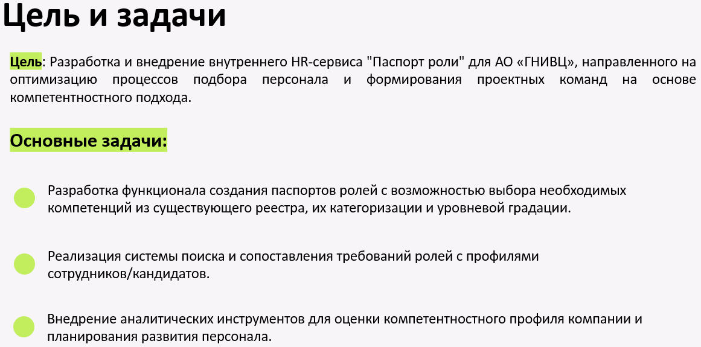

**Модель процесса AS IS:**
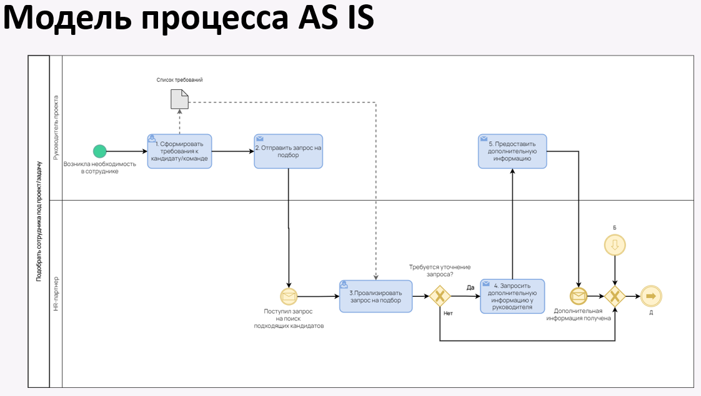
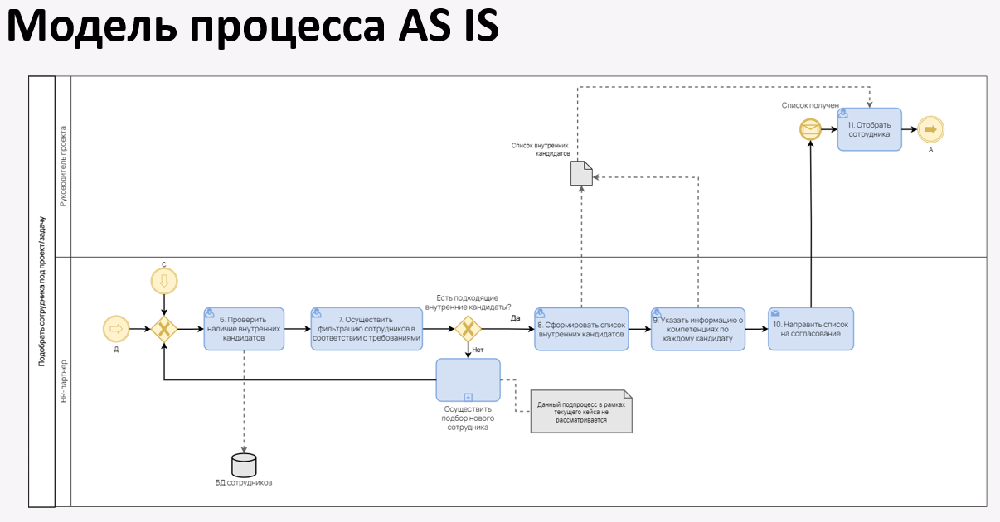
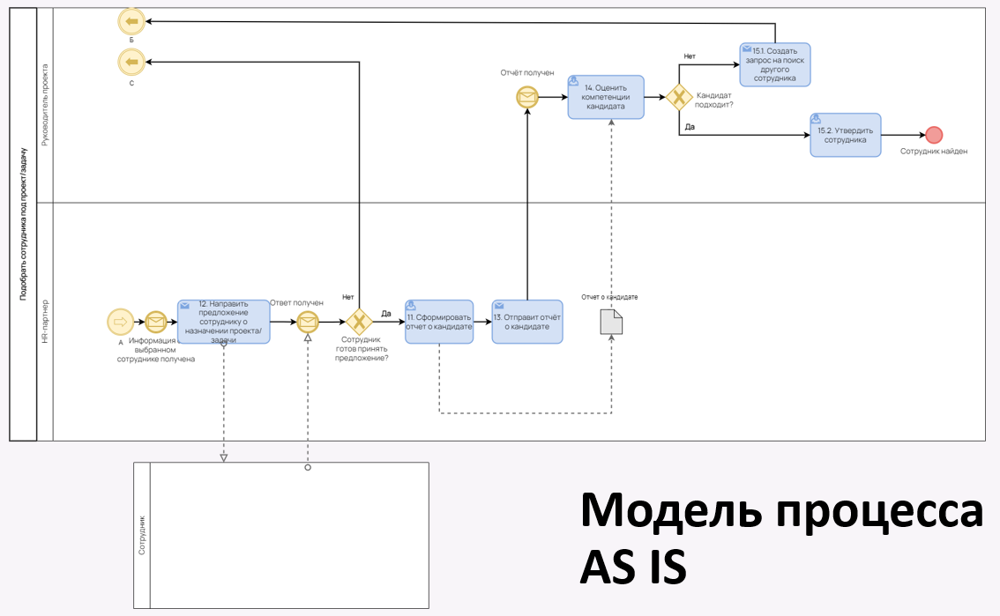

**Проблемы текущих бизнес-процессов:**
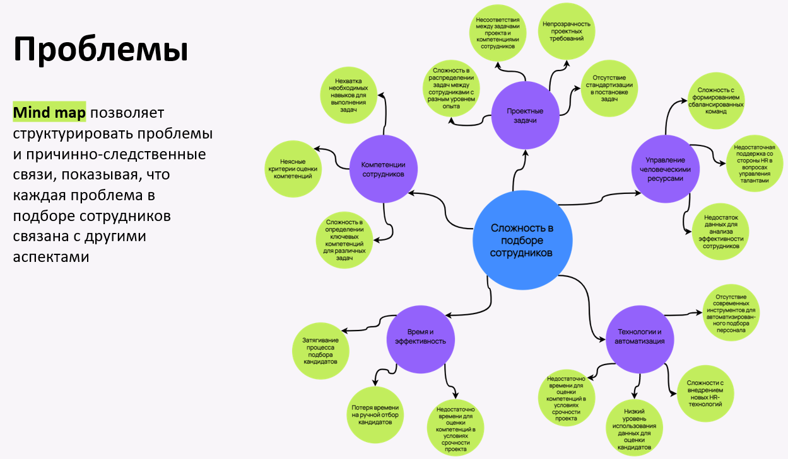

**Решение:**
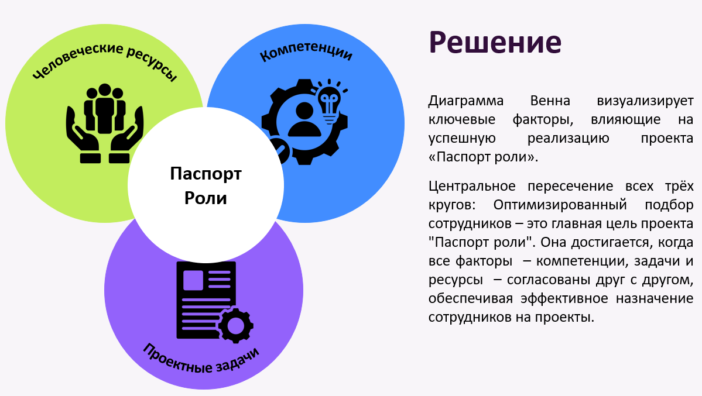
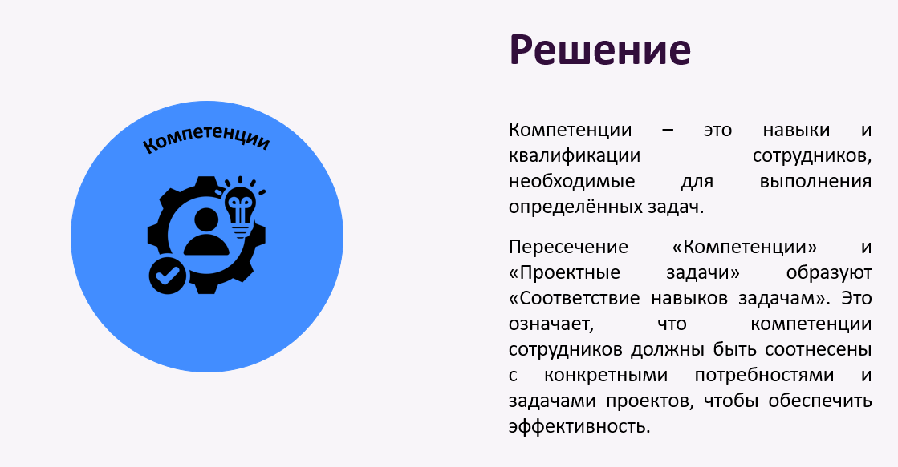
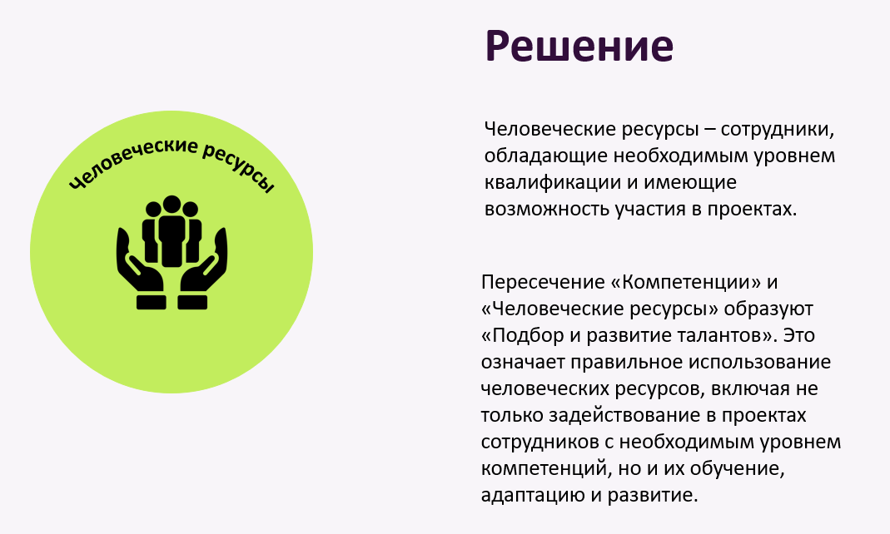

**Диаграмма прецедентов:**
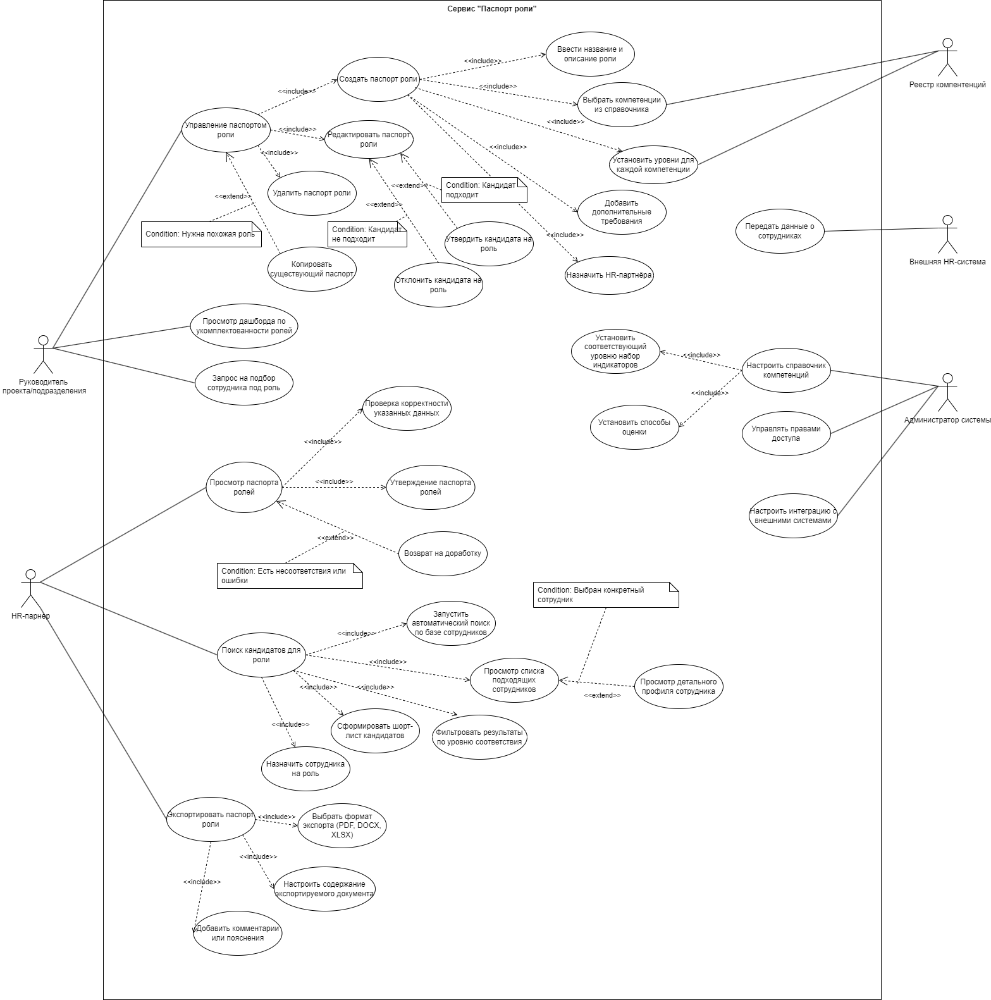

**Анализ конкурентов:**
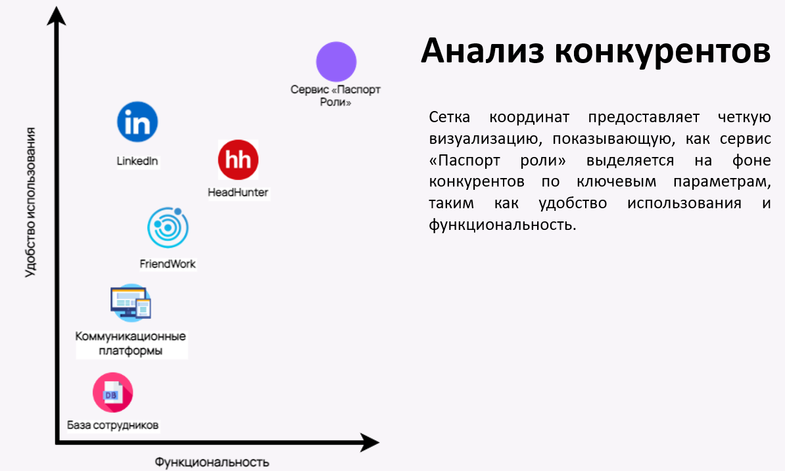

**Затраты на разработку:**
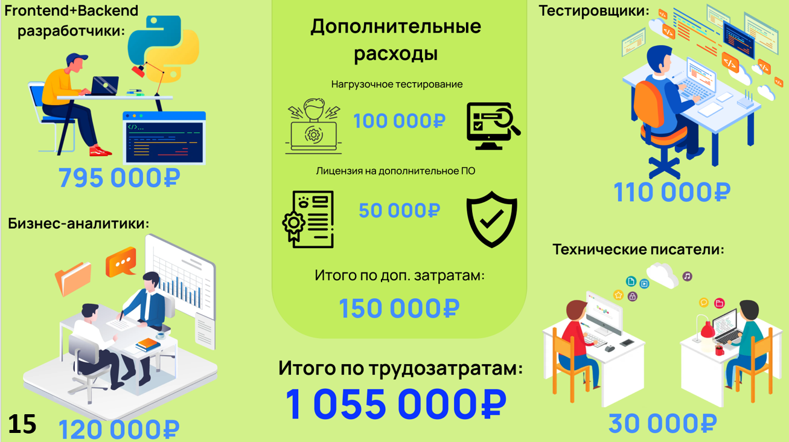