# 1. ОПИСАНИЕ ПОЛЬЗОВАТЕЛЬСКИХ ИНТЕРФЕЙСОВ

## 1.1.	<Экранная форма 1. Авторизация>

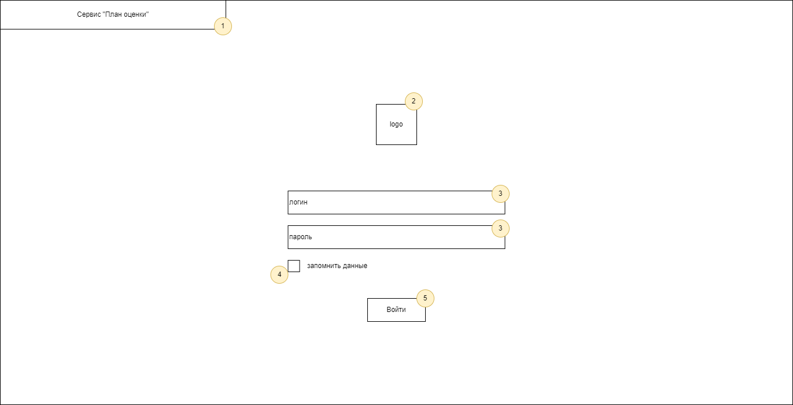

| № п/п | Наименование элемента | Тип элемента | Назначение элемента | Описание, комментарии, ограничения |
|----|----|----|----|----|
| 1 | Сервис "План оценки" | Шапка окна | Отображает название сервиса | Данный элемент не кликабельный |
| 2 | Logo | Изображение | Отображает логотип сервиса | Данный элемент не кликабельный |
| 3 | Логин/Пароль | Строка ввода | Позволяет пользователю ввести логин и пароль |  |
| 4 | Запомнить данные | Чекбокс | При нажатии система сохранить данные логина и пароля |   |
| 5 | Войти | Кнопка | Позволяет пользователю авторизироваться в сервисе "План оценки" |   |

## 1.2.	<Экранная форма 2. Главный экран>

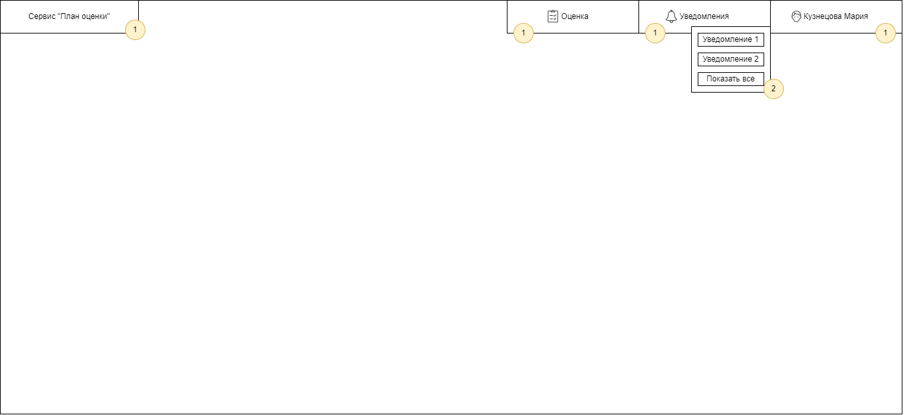

| № п/п | Наименование элемента | Тип элемента | Назначение элемента | Описание, комментарии, ограничения |
|----|----|----|----|----|
| 1 | Сервис "План оценки"/Оценка/Уведомления/ФИО сотрудника | Шапка окна | Отображает название элементов главного окна | Переход на вкладки "Оценка"/"Уведомления" соответственно |
| 2 | Уведомление 1/Уведомление 2/Показать все | Выпадающее меню | Отображает новые уведомления | Позволяет перейти к уведомлению или показать все |

## 1.3.	<Экранная форма 3. История уведомлений>

### 1.3.1. Экранная форма истории уведомлений для специалиста по обучению
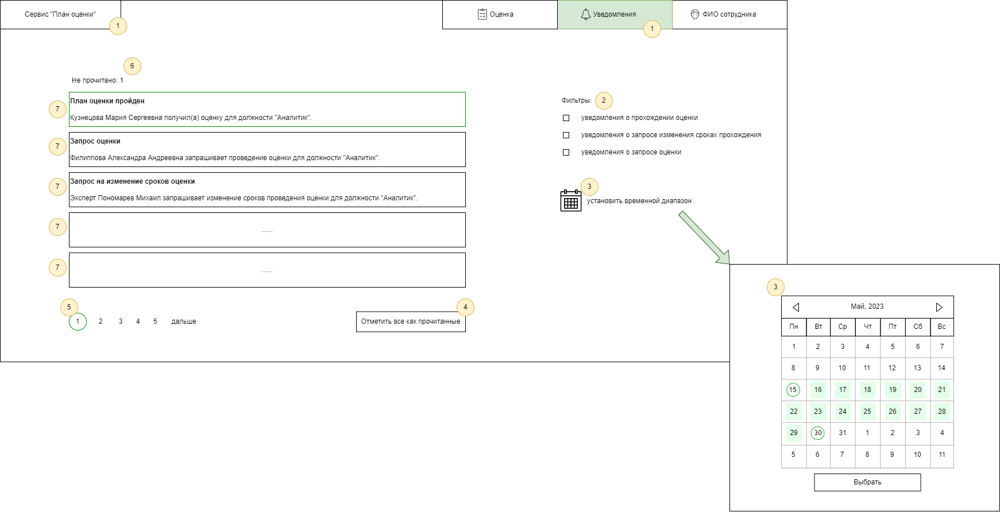

| № п/п | Наименование элемента | Тип элемента | Назначение элемента | Описание, комментарии, ограничения |
|----|----|----|----|----|
| 1 | Сервис "План оценки"/Оценка/Уведомления/ФИО сотрудника | Шапка окна | Отображает название сервиса | Данный элемент не кликабельный |
| 2 | Фильтры | Фильтры | Позволяет установить фильтры выдачи | Сортируют уведомления по категориям: прохождени оценки, запрос изменения сроков, запрос оценки |
| 3 | Установить временной диапозон | Кнопка | Позволяет выбрать дату или временной промежуток | По клику на иконку календаря появляется календарь |
| 4 | Отметить все как прочитанные | Кнопка | Позволяет отметить все непрочитанные уведомления прочитанными |  |
| 5 | Номера страниц | Кнопка | Позволяет выбрать страницу |   |
| 6 | Не прочитано: 1 | Метка | Показывает количество непрочитанных уведомлений |   |
| 7 | Уведомление | Кнопка | Отобпажает тело уведомления |   |

### 1.3.2. Экранная форма истории уведомлений для эксперта

| № п/п | Наименование элемента | Тип элемента | Назначение элемента | Описание, комментарии, ограничения |
|----|----|----|----|----|
| 1 | Сервис "План оценки"/Оценка/Уведомления/ФИО сотрудника | Шапка окна | Отображает название сервиса | Данный элемент не кликабельный |
| 2 | Фильтры | Фильтры | Позволяет установить фильтры выдачи | Сортируют уведомления по категориям: изменение сроков, назначение оценки |
| 3 | Установить временной диапозон | Кнопка | Позволяет выбрать дату или временной промежуток | По клику на иконку календаря появляется календарь |
| 4 | Отметить все как прочитанные | Кнопка | Позволяет отметить все непрочитанные уведомления прочитанными |  |
| 5 | Не прочитано: 0 | Метка | Показывает количество непрочитанных уведомлений |   |
| 6 | Уведомление | Кнопка | Отобпажает тело уведомления |   |

### 1.3.3. Экранная форма истории уведомлений для сотрудника
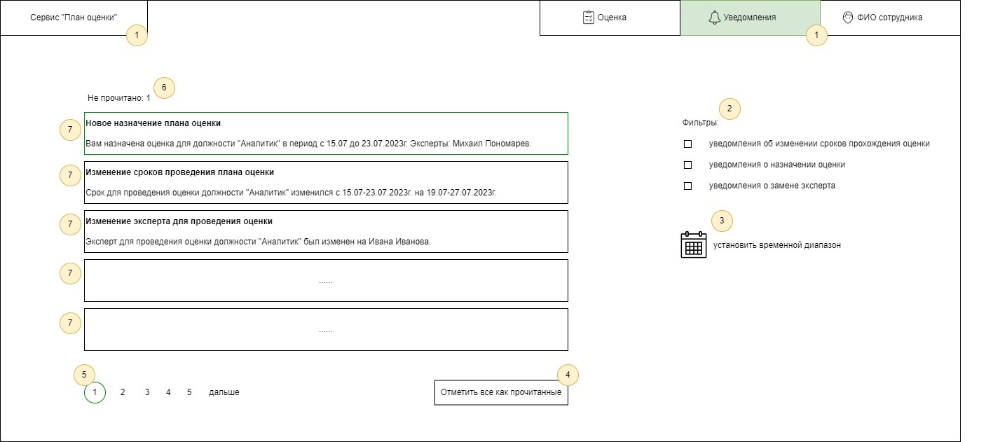

| № п/п | Наименование элемента | Тип элемента | Назначение элемента | Описание, комментарии, ограничения |
|----|----|----|----|----|
| 1 | Сервис "План оценки"/Оценка/Уведомления/ФИО сотрудника | Шапка окна | Отображает название сервиса | Данный элемент не кликабельный |
| 2 | Фильтры | Фильтры | Позволяет установить фильтры выдачи | Сортируют уведомления по категориям: изменение сроков, замена эксперта, назначение оценки |
| 3 | Установить временной диапозон | Кнопка | Позволяет выбрать дату или временной промежуток | По клику на иконку календаря появляется календарь |
| 4 | Отметить все как прочитанные | Кнопка | Позволяет отметить все непрочитанные уведомления прочитанными |  |
| 5 | Номера страниц | Кнопка | Позволяет выбрать страницу |   |
| 6 | Не прочитано: 1 | Метка | Показывает количество непрочитанных уведомлений |   |
| 7 | Уведомление | Кнопка | Отобпажает тело уведомления |   |

## 1.4.	Экранная форма 4. Тестирование сотрудника.

### 1.4.1. Экранная форма - Личный кабинет сотрудника (вкладка оценки).
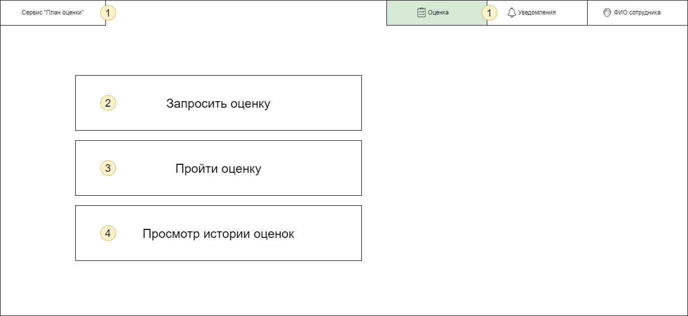
| № п/п | Наименование элемента | Тип элемента | Назначение элемента | Описание, комментарии, ограничения |
|----|----|----|----|----|
| 1 | Сервис "План оценки"/Оценка/Уведомления/ФИО сотрудника | Шапка окна | Отображает название элементов главного окна | Переход на вкладки "План оценки"/"Оценка"/"Уведомления" соответственно |
| 2 | Запросить оценку | Кнопка | Переход ко вкладке "Заявка на проведение оценки" | Экранная форма 4.2 |
| 3 | Пройти оценку | Кнопка | Переход ко вкладке "Прохождение оценки" | Экранная форма 4.3 |
| 4 | Просмотр истории оценок | Кнопка | Переход ко вкладке "История оценок" | Экранная форма 4.4 |

### 1.4.2. Экранная форма - Заявка на проведение оценки.
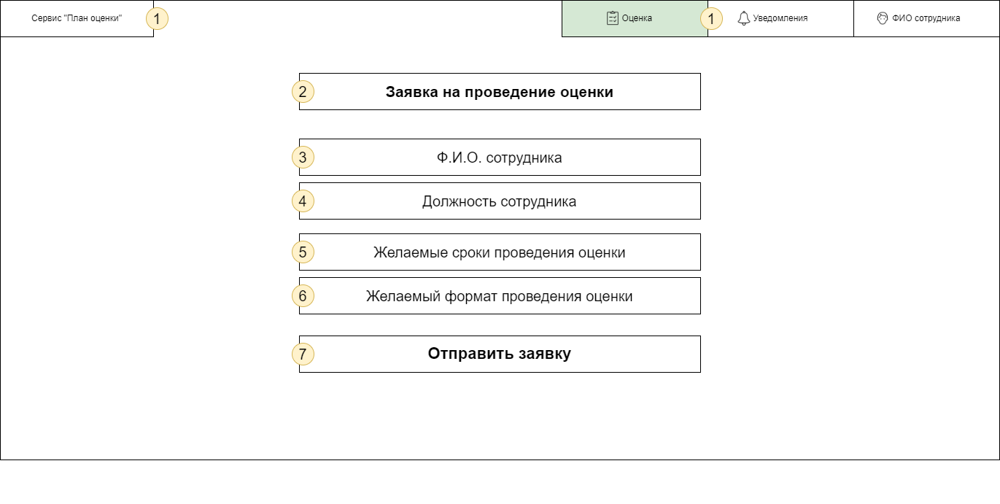
| № п/п | Наименование элемента | Тип элемента | Назначение элемента | Описание, комментарии, ограничения |
|----|----|----|----|----|
| 1 | Сервис "План оценки"/Оценка/Уведомления/ФИО сотрудника | Шапка окна | Отображает название элементов главного окна | Переход на вкладки "План оценки"/"Оценка"/"Уведомления" соответственно |
| 2 | Заявка на проведение оценки | Метка | Заголовок страницы |  |
| 3 | Ф.И.О. сотрудника | Метка | Отображает Ф.И.О сотрудника | Подставляется автоматически |
| 4 | Должность сотрудника | Метка | Отображает должность сотрудника, по которой будет проводится оценк | Подставляется автоматически на основе Ф.И.О сотрудника. Имеется возможность изменить должность вручную, если кандидат желает перейти на другую должность |
| 5 | Желаемые сроки проведения оценки | Кнопка | Открывает календарь, позволяющий выбрать желаемые сроки |  |
| 6 | Желаемый формат проведения оценки | Выпадающий список | Выбор желаемого формата оценки | При нажатии на поле выпадает список со следующими элементами "Тестирование","Интервью","Подтверждение документов" |
| 7 | Отправить заявку | Кнопка | Отправляет заявку специалисту по обучению для формирования плана | Появляется уведомление на экране "Заявка успешно отправлена", либо "Заявку не удалось отправить" при возникновении тех.ошибок |

### 1.4.3. Экранная форма - Информация о оценке.
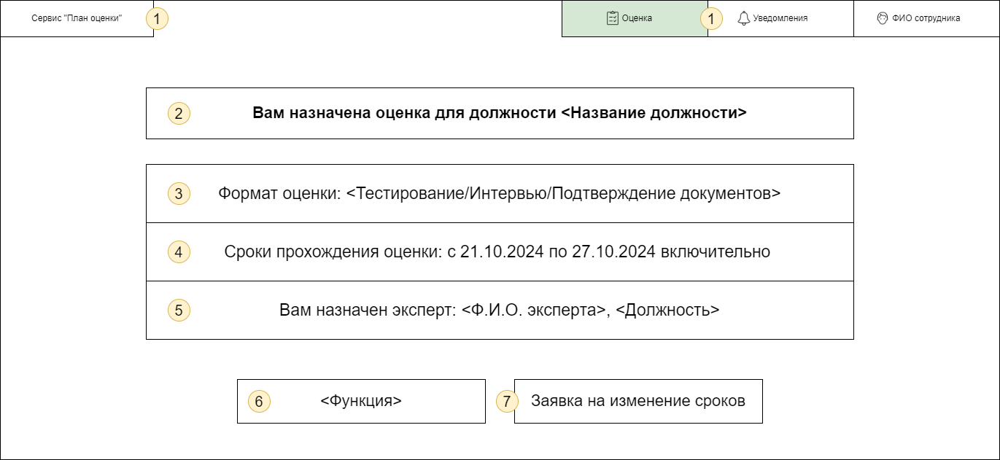
| № п/п | Наименование элемента | Тип элемента | Назначение элемента | Описание, комментарии, ограничения |
|----|----|----|----|----|
| 1 | Сервис "План оценки"/Оценка/Уведомления/ФИО сотрудника | Шапка окна | Отображает название элементов главного окна | Переход на вкладки Сервис "План оценки"/"Оценка"/"Уведомления" соответственно |
| 2 | Вам назначена оценка для должности <Название должности> | Метка | Отображает заголовок страницы, с указанием должности, для которой проводится оценка |  |
| 3 | Формат оценки | Метка | Отображение формата оценки Тестирование, Интервью или Подтверждение документов |  |
| 4 | Сроки | Метка | Отображение сроков прохождения оценок с DD-MM-YY по DD-MM-YY включительно |  |
| 5 | Эксперт | Метка | Отображение Ф.И.О эксперта назначенного сотруднику |  |
| 6 | <Функция> | Кнопка | В зависимости от формата оценки перенаправляет на определенные функции и отображает соответствующий текст на кнопке | см. п/п 6.1, 6.2, 6.3 |
| 6.1 | Перейти к тестированию | Кнопка | Открытие вкладки "Тестирование" | Экранная форма 5.1 |
| 6.2 | Перейти к интервью | Кнопка | Перенаправление на видео-встречу (внешняя ссылка на Express/Zoom и т.д)  |  |
| 6.3 | Выбрать документы для подтверждения | Кнопка | выбор файла/ов с компьютера для загрузки в систему |  | 
| 7 | Заявка на изменение сроков | Кнопка | Позволяет пользователю отправить заявку на изменению сроков с укзанием новых, если они ему не подходят |  |

### 1.4.4. Экранная форма - История оценок.
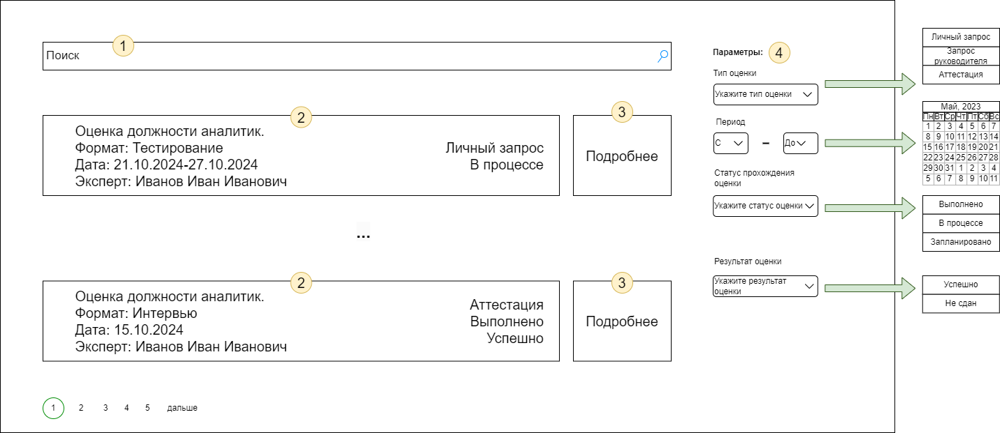
| № п/п | Наименование элемента | Тип элемента | Назначение элемента | Описание, комментарии, ограничения |
|----|----|----|----|----|
| 1 | Поиск | Строка поиска | Позволяет пользователю осуществлять поиск среди оценок |  |
| 2 | Описание | Метка | Краткое описание прохождения оценки сотрудником(формат, дата, эксперт) |  |
| 3 | Подробне | Кнопка | Открывает вкладку с подробной  информацией о тесте |  |
| 4 | Параметры | Фильтры | Осуществляет фильтрацию результатов поиска | Включает в себя такие параметры, как "Тип оценки"(Личный запрос/запрос руководителя/аттестация), "Период", "Статус прохождения оценки"(Выполнено, В процессе, Запланировано), "Результат" (Успешно, Тест не сдан) |

## 1.5.	Экранная форма 5. Тестирование сотрудника.

### 1.5.1. Экранная форма - Прохождение тестирования.
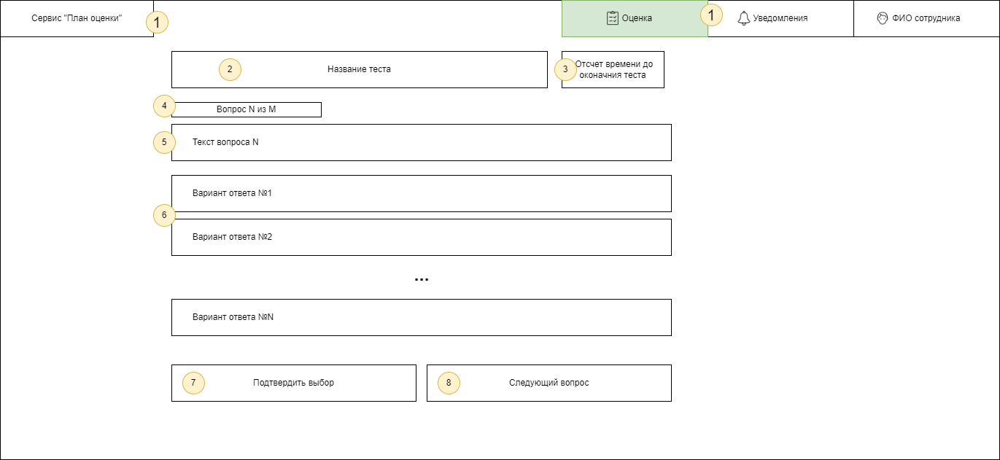
| № п/п | Наименование элемента | Тип элемента | Назначение элемента | Описание, комментарии, ограничения |
|----|----|----|----|----|
| 1 | Сервис "План оценки"/Оценка/Уведомления/ФИО сотрудника | Шапка окна | Отображает название элементов главного окна | Переход на вкладки "План оценки"/"Оценка"/"Уведомления" соответственно |
| 2 | Название теста | Метка | Отображает название теста |  |
| 3 | Отсчет времени | Таймер | Показывает время до окончания теста | При истечении времени тест автоматически завершается |
| 4 | № Вопроса | Метка | Показывает № вопроса из общего числа вопросов |  |
| 5 | Текст вопроса | Метка | Отображает текст вопроса |  |
| 6 | Варианты ответа | Радио-кнопка/Чекбокс | Кнопка для выбора ответа на вопрос | Тип элемента зависит от типа вопроса (с одним или множественным выбором) |
| 7 | Подтвердить выбор | Кнопка | Кнопка подтверждения выбора | Отменить выбор нельзя |
| 8 | Перейти к следующему вопросу | Кнопка | Переход к следующему вопросу | Переход к предыдущему вопросу невозможен |

### 1.5.2. Экранная форма - Результаты тестирования сотрудника.
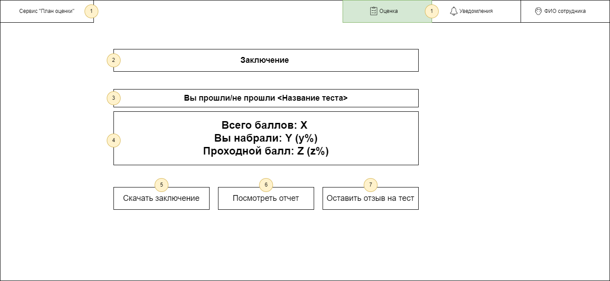
| № п/п | Наименование элемента | Тип элемента | Назначение элемента | Описание, комментарии, ограничения |
|----|----|----|----|----|
| 1 | Сервис "План оценки"/Оценка/Уведомления/ФИО сотрудника | Шапка окна | Отображает название элементов главного окна | Переход на вкладки "План оценки"/"Оценка"/"Уведомления" соответственно |
| 2 | Заключение | Метка | Отображает название документа |  |
| 3 | Результат 1 | Метка | Отображает информации о прохождении теста(прошли/не прошли) и название теста |  |
| 4 | Результат 2 | Метка | Отображает общее кол-во баллов теста - X, кол-во набранных баллов пользователем - Y и проходной балл - Z | В скобках после баллов указывается процентное соотношение |
| 5 | Скачать заключение | Кнопка | Скачивает документ "Заключение" на пк |  |
| 6 | Посмотреть отчет | Кнопка | Переход к документу "Отчет" |  |
| 7 | Оставить отзыв | Кнопка | Переход на вкладку "Отзыв" | Позволяет пользователю оставить отзыв на тест, указать на ошибки и недочеты в тесте |

### 1.5.3. Экранная форма - "Отчет о тестировании сотрудника".

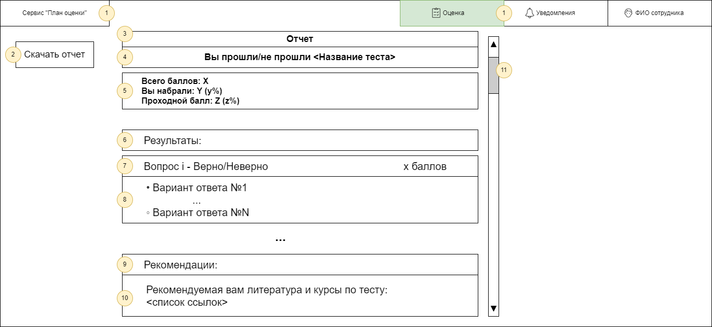
| № п/п | Наименование элемента | Тип элемента | Назначение элемента | Описание, комментарии, ограничения |
|----|----|----|----|----|
| 1 | Сервис "План оценки"/Оценка/Уведомления/ФИО сотрудника | Шапка окна | Отображает название элементов главного окна | Переход на вкладки "План оценки"/"Оценка"/"Уведомления" соответственно |
| 2 | Скачать отчет | Кнопка | Скачивает документ "Отчет" на пк |  |
| 3 | Отчет | Метка | Отображает название документа |  |
| 4 | Результат 1 | Метка | Отображает информации о прохождении теста(прошли/не прошли) и название теста |  |
| 5 | Результат 2 | Метка | Отображает общее кол-во баллов теста - X, кол-во набранных баллов пользователем - Y и проходной балл - Z | В скобках после баллов указывается процентное соотношение |
| 6 | Результаты | Метка | Заголовок для элементов 7-8 |  |
| 7 | Вопрос i | Метка | Номер вопроса, его текст, верно/неверно ответил пользователь | Элемент 7 повторяется для каждого вопроса |
| 8 | Варианты ответов | Метка | Отображает варианты ответов на i-ый вопрос с выбранным пользователем ответом (ответ пользователя отображается жирной точкой вначале ) | Элемент 7 повторяется для каждого вопроса, после элемента 7 |
| 9 | Рекомендации | Метка | Заголовок для элемента 9 |  |
| 10 | Список рекомендаций | Метка | Отображает список рекомендаций из "реестра компетенций" |  |
| 11 | Ползунок | Ползунок | Для перемещения по странице вверх/вниз |  |

## 1.6.	Экранная форма 6. Оценки (страница эксперта).

### 1.6.1. Экранная форма - Вкладка оценки (эксперт).
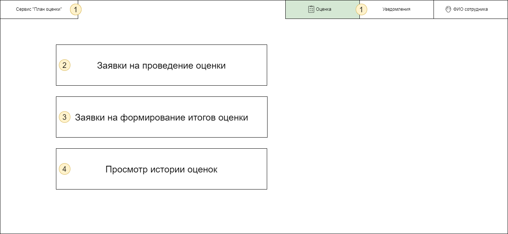
| № п/п | Наименование элемента | Тип элемента | Назначение элемента | Описание, комментарии, ограничения |
|----|----|----|----|----|
| 1 | Сервис "План оценки"/Оценка/Уведомления/ФИО сотрудника | Шапка окна | Отображает название элементов главного окна | Переход на вкладки "План оценки"/"Оценка"/"Уведомления" соответственно |
| 2 | Заявки на проведение оценки | Кнопка | Переход ко вкладке "Заявки на проведение оценки" | Экранная форма 6.2 |
| 3 | Заявки на формирование итогов оценки | Кнопка | Переход ко вкладке "Заявки на формирование итогов оценки" | Экранная форма 6.3 |
| 4 | Просмотр истории оценок | Кнопка | Переход ко вкладке "История оценок" | Экранная форма 6.5 |

### 1.6.2. Экранная форма - Заявки на проведение оценки.
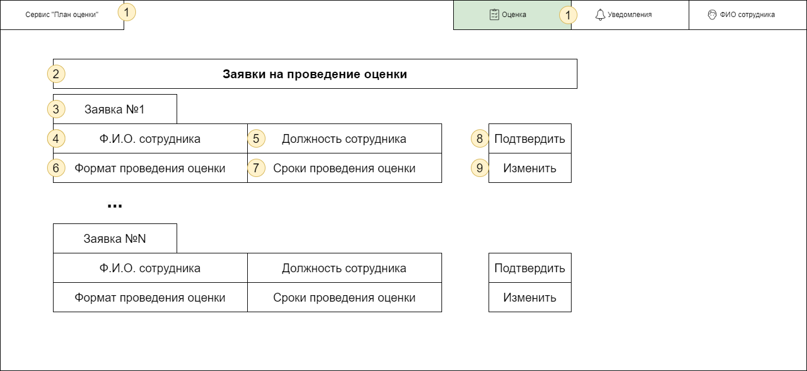
| № п/п | Наименование элемента | Тип элемента | Назначение элемента | Описание, комментарии, ограничения |
|----|----|----|----|----|
| 1 | Сервис "План оценки"/Оценка/Уведомления/ФИО сотрудника | Шапка окна | Отображает название элементов главного окна | Переход на вкладки "План оценки"/"Оценка"/"Уведомления" соответственно |
| 2 | Заявки на проведение оценки | Метка | Заголовок страницы |  |
| 3 | Заявка №N | Метка | Отображает номер заявки |  |
| 4 | Ф.И.О. сотрудника | Метка | Отображает Ф.И.О сотрудника | Подставляется автоматически |
| 5 | Должность сотрудника | Метка | Отображает должность сотрудника, по которой будет проводится оценка | Подставляется автоматически |
| 6 | Формат проведения оценки | Метка | Указан 1 из 3 форматов: "Тестирование","Интервью","Подтверждение документов" | |
| 7 | Сроки проведения оценки | Метка | Указаны сроки, в которые необходимо провести оценку |  |
| 8 | Подтвердить | Кнопка | Подтверждает принятие экспертом заявки на оценку | |
| 9 | Изменить | Кнопка | Позволяет эксперту изменить сроки или формат оценки и отправить на дальнейшее согласование спец. по оценке |  |

### 1.6.3. Экранная форма - Заявки на формирование итогов оценки.

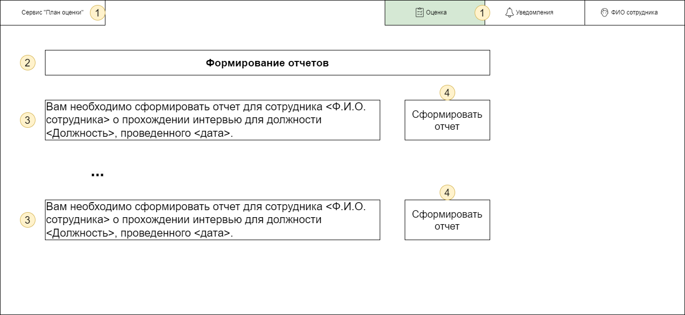
| № п/п | Наименование элемента | Тип элемента | Назначение элемента | Описание, комментарии, ограничения |
|----|----|----|----|----|
| 1 | Сервис "План оценки"/Оценка/Уведомления/ФИО сотрудника | Шапка окна | Отображает название элементов главного окна | Переход на вкладки "План оценки"/"Оценка"/"Уведомления" соответственно |
| 2 | Формирование отчетов | Метка | Заголовок страницы |  |
| 3 | Информация об отчете | Метка | Отражает краткую информацию о том для какой оценки необходимо сформировать отчет: ФИО сотрудника, должность, дата |  |
| 4 | Сформировать отчет | Кнопка | Открывает вкладку для формирования отчета | Экранная форма 5.4 |

### 1.6.4. Экранная форма - Формирование отчета экспертом.

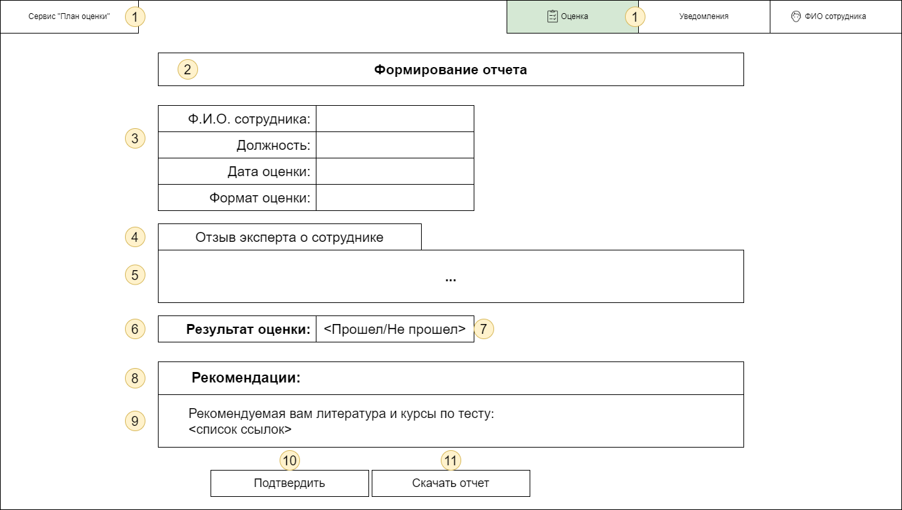
| № п/п | Наименование элемента | Тип элемента | Назначение элемента | Описание, комментарии, ограничения |
|----|----|----|----|----|
| 1 | Сервис "План оценки"/Оценка/Уведомления/ФИО сотрудника | Шапка окна | Отображает название элементов главного окна | Переход на вкладки "План оценки"/"Оценка"/"Уведомления" соответственно |
| 2 | Формирование отчета | Метка | Заголовок страницы |  |
| 3 | Данные оценки | Метка | Данные о прохождение оценки: ФИО сотрудника, должность, дата оценки, формат оценки | Подставляются автоматически из реестра компетений |
| 4 | Отзыв эксперта о сотруднике | Метка | Заголовок элемена 5 |  |
| 5 | Отзыв эксперта о сотруднике | Поле | Поле для ввода экспертом отзыва о сотруднике, о его проходении оценки |  |
| 6 | Результат оценки | Метка | Заголовок для метки 7 |  |
| 7 | Результат | Метка | Отображение результата оценки: Прошел/Не прошел |  |
| 8 | Рекомендации | Метка | Заголовок для элемента 9 |  |
| 9 | Список рекомендаций | Метка | Отображает список рекомендаций из "реестра компетенций" |  |
| 10 | Подтвердить | Кнопка | Подтвердить сохранение отчета и отправку его сотруднику | |
| 11 | Скачать отчет | Кнопка | Скачивает документ "Отчет" на пк |  |

### 1.6.5. Экранная форма - Просмотр истории оценок.

| № п/п | Наименование элемента | Тип элемента | Назначение элемента | Описание, комментарии, ограничения |
|----|----|----|----|----|
| 1 | Поиск | Строка поиска | Позволяет пользователю осуществлять поиск среди оценок |  |
| 2 | Описание | Метка | Краткое описание прохождения оценки сотрудником(формат, дата, сотрудник) |  |
| 3 | Подробне | Кнопка | Открывает вкладку с подробной  информацией о тесте |  |
| 4 | Параметры | Фильтры | Осуществляет фильтрацию результатов поиска | Включает в себя такие параметры, как "Тип оценки"(Личный запрос/запрос руководителя/аттестация), "Период", "Статус прохождения оценки"(Выполнено, В процессе, Запланировано), "Результат" (Успешно, Тест не сдан) |

## 1.7.	Экранная форма 7. Оценки (страница специалиста по обучению).

### 1.7.1. Экранная форма - Вкладка оценки ( специалист по обучению).
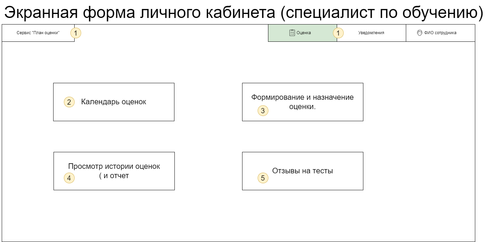
| № п/п | Наименование элемента | Тип элемента | Назначение элемента | Описание, комментарии, ограничения |
|----|----|----|----|----|
| 1 | Сервис "План оценки"/Оценка/Уведомления/ФИО сотрудника | Шапка окна | Отображает название элементов главного окна | Переход на вкладки "План оценки"/"Оценка"/"Уведомления" соответственно |
| 2 | Календарь оценок | Кнопка | Переход ко вкладке "Заявка на проведение оценки" | Экранная форма 7.2 |
| 3 | Формирование и назначение оценки. | Кнопка | Переход ко вкладке "История оценок" | Экранная форма 7.3 |
| 4 | Просмотр истории оценок (и отчетов) | Кнопка | Переход ко вкладке "Прохождение оценки" | Экранная форма 7.4 |
| 5 | Отзывы на тесты | Кнопка | Переход ко вкладке "История оценок" | Экранная форма 7.6 |

### 1.7.2. Экранная форма - Календарь оценок.
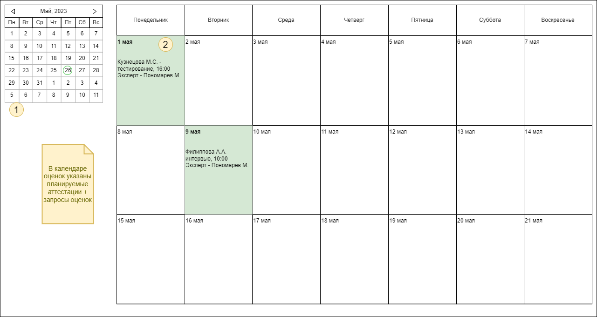
| № п/п | Наименование элемента | Тип элемента | Назначение элемента | Описание, комментарии, ограничения |
|----|----|----|----|----|
| 1 | Мини-календарь | Календарь | Позволяет выбрать период, для его отображения в поле 2 |  |
| 2 | Календарь оценок | Поле | Таблица, где в столбцах  с соответвующими днями отмечены планы сотрудника | |

### 1.7.3. Экранная форма - Формирование и назначение оценки.
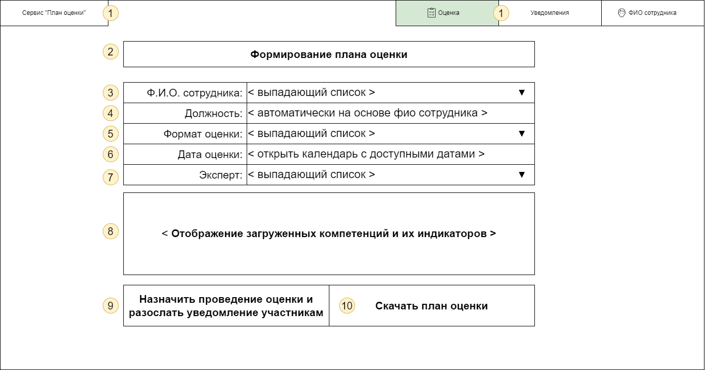
| № п/п | Наименование элемента | Тип элемента | Назначение элемента | Описание, комментарии, ограничения |
|----|----|----|----|----|
| 1 | Сервис "План оценки"/Оценка/Уведомления/ФИО сотрудника | Шапка окна | Отображает название элементов главного окна | Переход на вкладки "План оценки"/"Оценка"/"Уведомления" соответственно |
| 2 | Формирование плана оценки | Метка | Заголовок страницы | |
| 3 | Ф.И.О. сотрудника | Выпадающий список  | Выбор сотрудника из имеющегося списка |  |
| 4 | Должность | Метка | Должность выбранного сотрудника | Автоматически на основе Ф.И.О сотрудника |
| 5 | Формат оценки | Выпадающий список  |  | Автоматически подставляет формат, указанный сотрудником в заявке, если таковая имеется |
| 6 | Дата оценки | Календарь | Отображает список свободных дат у участников | Автоматически подставляются даты, указанные сотрудником в заявке, если таковая имеется |
| 7 | Эксперт | Выпадающий список  | Отображает список доступных экспертов для выбора |  |
| 8 | Компетенции | Метка | Отображение загруженных компетенций и их индикаторов | |
| 9 | Назначить проведение оценки и разослать уведомление участникам | Кнопка | Назначает проведение оценки и рассылает уведомление участникам | |
| 10 | Скачать план оценки | Кнопка | Скачивает документ "План оценки" на пк | |

### 1.7.4. Экранная форма - Просмотр истории оценок.
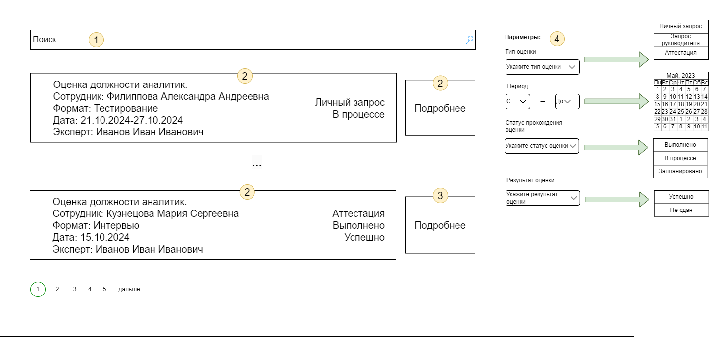
| № п/п | Наименование элемента | Тип элемента | Назначение элемента | Описание, комментарии, ограничения |
|----|----|----|----|----|
| 1 | Поиск | Строка поиска | Позволяет пользователю осуществлять поиск среди оценок |  |
| 2 | Описание | Метка | Краткое описание прохождения оценки сотрудником(сотрудник, формат, дата, эксперт) |  |
| 3 | Подробне | Кнопка | Открывает вкладку с подробной  информацией о тесте | Экранная форма 6.4 |
| 4 | Параметры | Фильтры | Осуществляет фильтрацию результатов поиска | Включает в себя такие параметры, как "Тип оценки"(Личный запрос/запрос руководителя/аттестация), "Период", "Статус прохождения оценки"(Выполнено, В процессе, Запланировано), "Результат" (Успешно, Тест не сдан) |

### 1.7.5. Экранная форма - Просмотр отчетов по прохождению оценок.
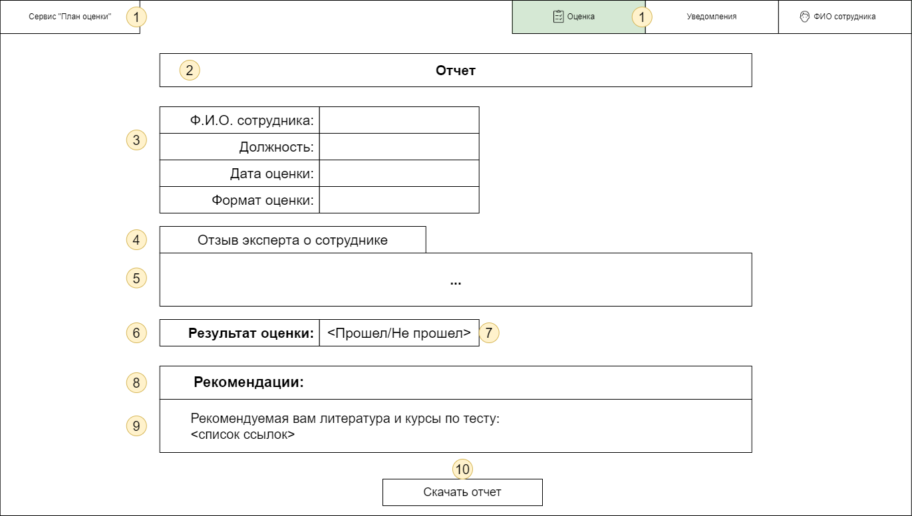
| № п/п | Наименование элемента | Тип элемента | Назначение элемента | Описание, комментарии, ограничения |
|----|----|----|----|----|
| 1 | Сервис "План оценки"/Оценка/Уведомления/ФИО сотрудника | Шапка окна | Отображает название элементов главного окна | Переход на вкладки "План оценки"/"Оценка"/"Уведомления" соответственно |
| 2 | Отчет | Метка | Заголовок страницы |  |
| 3 | Данные оценки | Метка | Данные о прохождение оценки: ФИО сотрудника, должность, дата оценки, формат оценки | Подставляются автоматически из реестра компетений |
| 4 | Отзыв эксперта о сотруднике | Метка | Заголовок элемена 5 |  |
| 5 | Отзыв эксперта о сотруднике | Поле | Поле для отображения отзыва эксперта о сотруднике, о его проходении оценки |  |
| 6 | Результат оценки | Метка | Заголовок для метки 7 |  |
| 7 | Результат | Метка | Отображение результата оценки: Прошел/Не прошел |  |
| 8 | Рекомендации | Метка | Заголовок для элемента 9 |  |
| 9 | Список рекомендаций | Метка | Отображает список рекомендаций из "реестра компетенций" |  |
| 10 | Скачать отчет | Кнопка | Скачивает документ "Отчет" на пк |  |

### 1.7.6. Экранная форма - Отзывы на тесты.
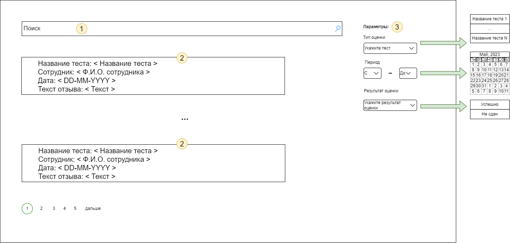
| № п/п | Наименование элемента | Тип элемента | Назначение элемента | Описание, комментарии, ограничения |
|----|----|----|----|----|
| 1 | Поиск | Строка поиска | Позволяет пользователю осуществлять поиск среди оценок |  |
| 2 | Описание | Метка | Включает в себя название теста, сотрудника, дату и сам текст отзыва |  |
| 4 | Параметры | Фильтры | Осуществляет фильтрацию результатов поиска | Включает в себя такие параметры, как "Тип оценки"(Личный запрос/запрос руководителя/аттестация), "Период", "Результат" (Успешно, Тест не сдан) |
