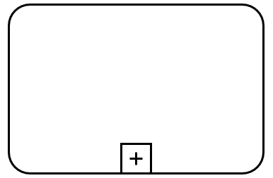
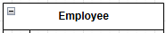
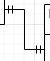
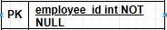
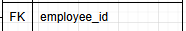

# 1. Виды представления графической информации
## 1.1.	Виды и назначение используемых диаграмм

**BPMN (Business Process Model and Notation)** — это стандартизированная графическая система, предназначенная для моделирования бизнес-процессов и отображения взаимодействия между участниками в них. Для отображения работы будущего бизнес-процесса используется BPMN-диаграмма, она повзоляет визуально отобразить последовательность работ бизнес-процессов и логику их выполнения. 

**ER-диаграмма (Entity-Relationship диаграмма)** — это инструмент для моделирования данных в информационных системах. Она помогает визуализировать структуру базы данных, показывая сущности, их атрибуты и взаимосвязи между ними.

## 1.2.	Обозначения элементов диаграмм

**Таблица 1 – Термины и сокращения для BPMN нотации**
| № п/п | Элемент | Наименование, описание | Для чего используется |
|----|----|----|----|
| 1 |  | Стартовое событие | Отражает начало процесса |
| 2 | | Финальное событие | Отражает конец процесса | 
| 3 |  | Подпроцесс | Составное действие, заключающее в себе Поток операций | 
| 4 |  | Пользовательское действие | Действие, которое выполняется пользователем с помощью ПО | 
| 5 |  | Отправка сообщений | Действие, которое заключается в отправке сообщения внешнему участнику процесса (имеющему отношение к данному бизнес-процессу) | 
| 6 |  | Хранилище данных | Cпециальный объект, который может использоваться бизнес-процессом для записи и / или извлечения данных | 

**Таблица 2 – Термины и сокращения для ER-диаграммы**
| № п/п | Элемент | Наименование, описание | Для чего используется |
|----|----|----|----|
| 1 |  | Сущность | Представляет объект или концепцию, например, "Сотрудник". |
| 2 |  | Связь | Отображает отношения между сущностями, например, связь между "Кандидат" и "Оценка". | 
| 3 |  | Атрибут | Описывает свойства сущности, например, "Имя" или "Возраст". | 
| 4 |  | Primary Key (первичный ключ) | Уникальный идентификатор записи в таблице базы данных. Он обеспечивает уникальность каждой строки и не может содержать NULL-значения.  | 
| 5 |  | Foreign Key (вторичный ключ) | Поле (или набор полей) в одной таблице, которое ссылается на первичный ключ другой таблицы. Внешний ключ используется для создания связи между двумя таблицами, обеспечивая целостность данных. | 

