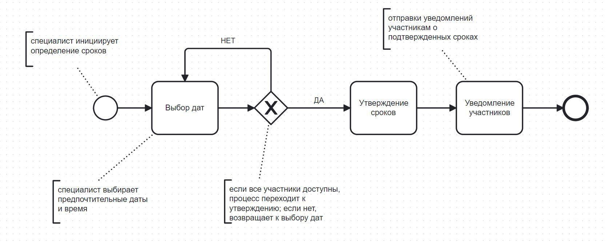
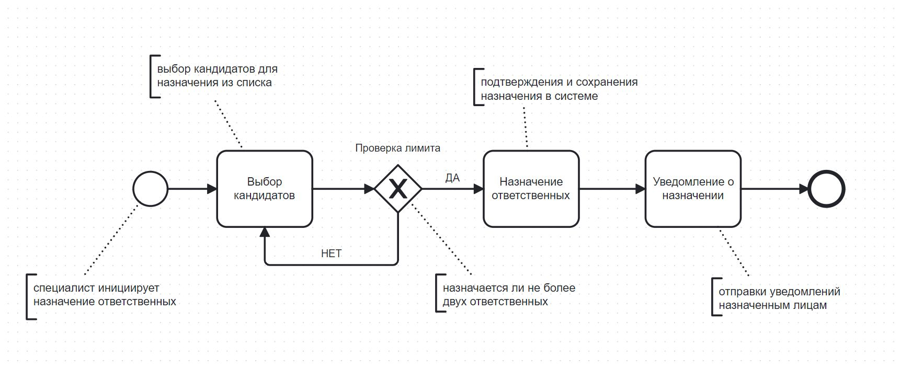
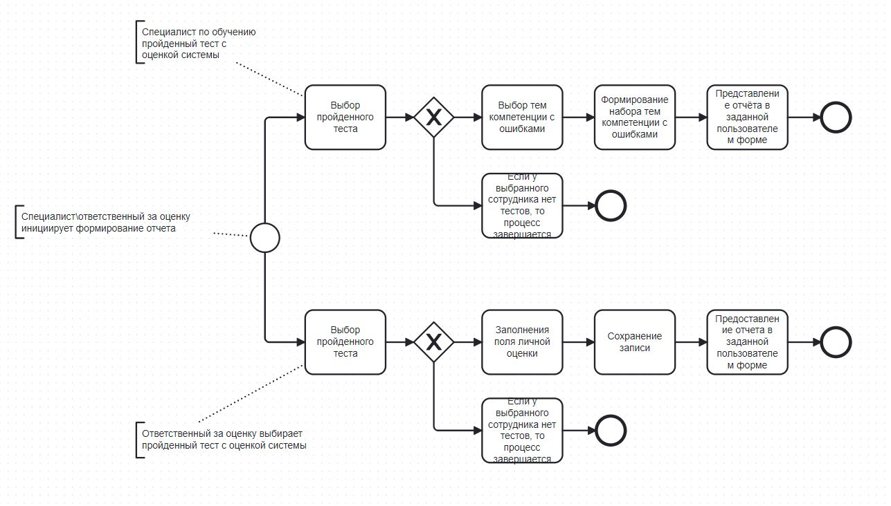
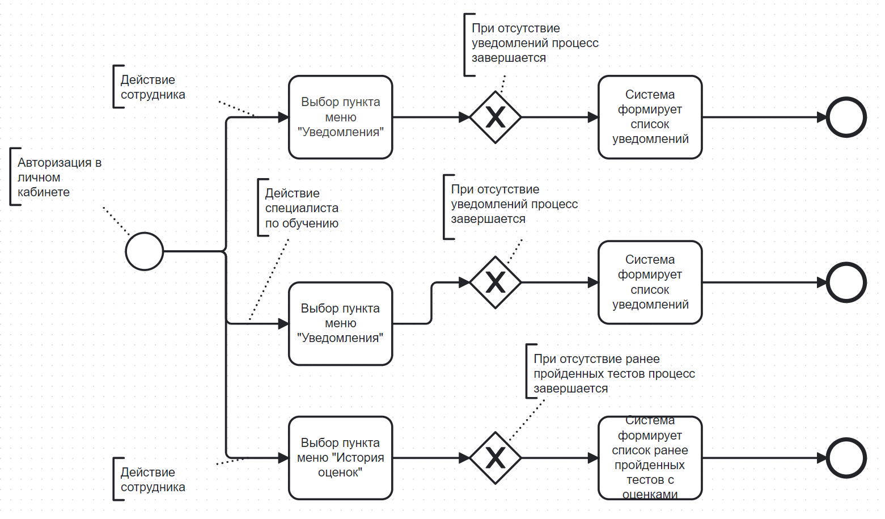

# 2.	ОПИСАНИЕ БИЗНЕС-ПРОЦЕССОВ

## 2.1. Формирование плана оценки
### Диаграмма бизнес-процесса
**1. Инициирование процесса**   Процесс начинается с запроса специалиста на оценку сотрудника.  
**2. Выбор сотрудника**   Специалист выбирает сотрудника для оценки.   Если данных по сотруднику нет в реестре компетенций - план не будет сформирован.   Если данные есть - будут отображены загруженные компетенции и индикаторы для выбранного сотрудника.  
**3. Утверждение сроков**   Специалист утверждает сроки проведения оценки.  
**4. Формирование плана оценки**   Специалист формирует план оценки, затем уведомляет ответственных лиц за оценку о сформированном плане.

### Описание процесса
- Роли: Специалист по обучению, сотрудники (ответственные лица)
- Входные данные: Запрос на формирование плана оценки
- Действие: Специалист инициирует процесс; выбирает кандидата для проведения оценки; утверждает сроки; формирует план оценки и уведомляет ответственных лиц
- Выходные данные: Сформированный план оценки

### Описание функций бизнес-процесса
Таблица 1 – Описание функций процесса 1
| **Параметр** | **Описание** |
|----------------------------------|--------------------------------------------------------------------------------------------------------------------------------------------------|
| **Роли пользователей** | Специалист по обучению, сотрудники (ответственные лица) |
| **Входные данные** | Запрос на формирование плана оценки |
| **Описание действия** | 1. Специалист инициирует процесс.   2. Выбирает кандидата для проведения оценки.   3.  Утверждает сроки.   4. Утверждение сроков при отсутствии конфликтов.   5. Уведомление участников. |
| **Выходные данные** | Сформированный план оценки. |

## 2.2. Определение сроков проверки
### Диаграмма бизнес-процесса
**1. Инициирование процесса**   Процесс начинается с запроса специалиста по обучению на установление сроков проверки   Проверка доступности  
**2. Система автоматически проверяет доступность всех участников на указанные даты и времена**   Если времени недостаточно, система генерирует уведомление о конфликте и возвращает пользователя к выбору новых дат  
**3. Утверждение сроков**   После проверки доступности система отправляет уведомление всем участникам с датами и временем проверки  
**4. Регистрация сроков**   Подтвержденные сроки сохраняются в системе, и процесс завершается  

### Описание процесса
- Роли: Специалист по обучению, сотрудники (участники проверки)
- Входные данные: Запрос на определение сроков, доступность участников
- Действие: Специалист инициирует процесс, выбирает предпочтительные даты; система проверяет доступность и уведомляет всех участников
- Выходные данные: Подтвержденные сроки проверки, уведомления участникам
### Описание функций бизнес-процесса
Таблица 2 – Описание функций процесса 2
| **Параметр** | **Описание** |
|----------------------------------|--------------------------------------------------------------------------------------------------------------------------------------------------|
| **Роли пользователей** | Специалист по обучению, сотрудники (участники проверки) |
| **Входные данные** | Запрос на определение сроков проверки, график доступности участников |
| **Описание действия** | 1. Специалист выбирает даты и время.   2. Система проверяет доступность.   3. Утверждение сроков при отсутствии конфликтов.   4. Уведомление участников. |
| **Выходные данные** | Подтвержденные даты и время проверки, уведомления участникам |

## 2.3. Назначение ответственных лиц
### Диаграмма бизнес-процесса
**1. Инициирование процесса**   Специалист по обучению инициирует процесс назначения ответственных за проверку  
**2. Выбор ответственных лиц**   Система предоставляет список доступных кандидатов, подходящих для роли ответственных  
**3. Проверка соответствия**   Система проверяет возможность назначения, учитывая текущее количество ответственных лиц для этой проверки (не более двух)  
**4. Назначение**   Специалист выбирает ответственных лиц, и система сохраняет эти данные  
**5. Уведомление**   Назначенные лица получают уведомления о своей роли и обязанностях  
**6. Завершение процесса**   Процесс завершается, и информация обновляется в системе  

### Описание процесса
- Роли: Специалист по обучению, ответственные лица
- Входные данные: Список кандидатов, текущая нагрузка ответственных лиц
- Действие: Специалист выбирает ответственных из предложенного списка, система проверяет и подтверждает назначение
- Выходные данные: Назначенные ответственные лица, уведомления о назначении

### Описание функций процесса
Таблица 3 – Описание функций процесса 3
| **Параметр** | **Описание** |
|:---|:---|
|Роли|Специалист по обучению, ответственные лица|
|Входные данные|Список кандидатов, текущая нагрузка ответственных лиц|
|Действие|Специалист выбирает ответственных из предложенного списка, система проверяет и подтверждает назначение|
|Выходные данные|Назначенные ответственные лица, уведомления о назначении|

## 2.4. Формирование отчета
### Диаграмма бизнес-процесса
1. Инициация формирования отчета
2. Выбор пройденного теста
3. Выбор специалистом по обучению тем компетенций с ошибками
4. Заполнение ответственным за оценку личной оценки за выбранный тест
5. Сохранение записи
6. Предоставление отчета в заданной пользователем форме
Отчет сохраняется в системе и процесс завершается  

### Описание процесса
- Роли: Специалист по обучению, ответственные лица
- Входные данные: Запрос на формирование отчета
- Действие: Специалист по обучению выбирает темы для каждой компетенции, система формирует набор тем и предоставляет отчет. Ответственный за оценку выбирает пройденный тест, заполняет собственную оценку, система сохраняет запись и предоставляет отчет
- Выходные данные: Набор тем, в которых тестируемый допустил ошибку. Полный отчет о результатах тестирования
### Описание функций бизнес-процесса
Таблица 4 – Описание функций процесса 4
| **Параметр** | **Описание** |
|----------------------------------|--------------------------------------------------------------------------------------------------------------------------------------------------|
| **Роли пользователей** | Специалист по обучению, ответственные лица |
| **Входные данные** | Запрос на формирование отчета |
| **Описание действия** | 1. Специалист по обучению выбирает пройденный тест с оценкой системы.   2. Система выбирает темы для каждой компетенции, в которых сотрудник (кандидат) допустил ошибку.   3. Система формирует набор подобных ошибок.   4. Специалист по обучению выбирает вид предоставления данного набора для дальнейшего анализа.   5. Ответственный за оценку выбирает пройденный тест сотрудником (кандидатом)   6. Заполняет поле для личной оценки   7. Сохраняет, либо редактирует запись   8. Выбирает вид предоставления полного отчета о результатах тестирования |
| **Выходные данные** | Набор тем, в которых тестируемый допустил ошибку. Полный отчет о результатах тестирования |

## 2.5. Личный кабинет
### Диаграмма бизнес-процесса
1. Авторизация в личном кабинете
2. Выбор пункта меню «Уведомления»
3. Формирование списка уведомлений
4. Выбор пункта меню «История оценок»
5. Формирование списка ранее пройденных тестов с оценками
Процесс завершается, и ранее непросмотренные уведомления или результаты тестов помечаются как просмотренные

 

### Описание процесса
- Роли: Специалист по обучению, сотрудники (участники проверки)
- Входные данные: Проверка уведомлений и просмотр истории оценок
- Действие: Сотрудник и специалист по обучению проходят авторизацию в личном кабинете. Сотруднику и специалисту по обучению система формирует список уведомлений, а также, система формирует сотруднику историю пройденных тестов с оценками
- Выходные данные: Уведомления о предстоящих оценках сотрудника. История пройденных оценок сотрудника. Уведомления о предстоящих датах оценок
### Описание функций процесса
Таблица 5 – Описание функций процесса 5
| **Параметр** | **Описание** |
|----------------------------------|-------------------------------------------------------------------------------------------------------------------------------------------------
| **Роли пользователей** | Специалист по обучению, сотрудники (участники проверки) |
| **Входные данные** | Проверка уведомлений и просмотр истории оценок |
| **Описание действия** | 1. Сотрудник, зайдя в личный кабинет, выбирает пункт меню «Уведомления»   2. Система формирует список полученных уведомлений сотрудника о предстоящих оценках компетенций   3. Сотрудник переходит в пункт меню «История оценок»    4. Система сформирует список всех, ранее пройденных оценок сотрудника   5. Специалист по обучению, зайдя в личный кабинет, выбирает пункт меню «Уведомления»   6. Система формирует список полученных уведомлений сотрудника о датах предстоящих оценках компетенций сотрудников |
| **Выходные данные** | Уведомления о предстоящих оценках сотрудника. История пройденных оценок сотрудника. Уведомления о предстоящих датах оценок |