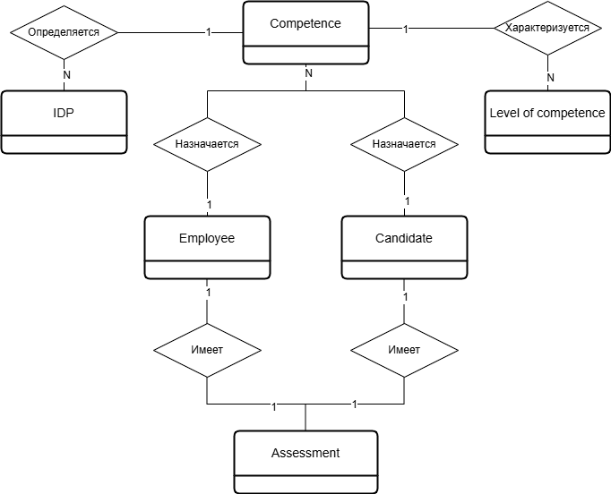
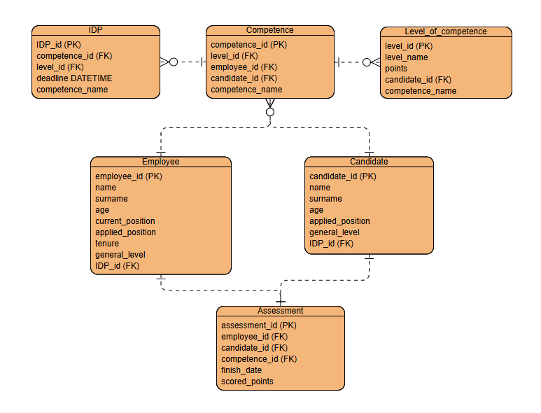
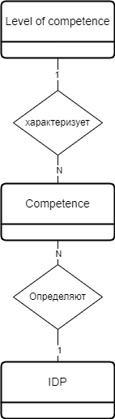
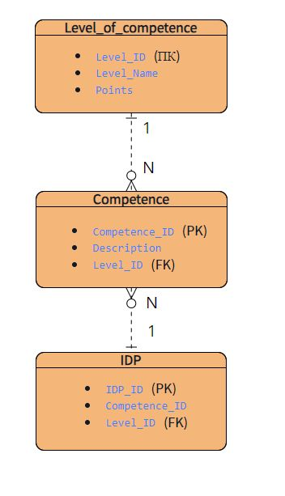
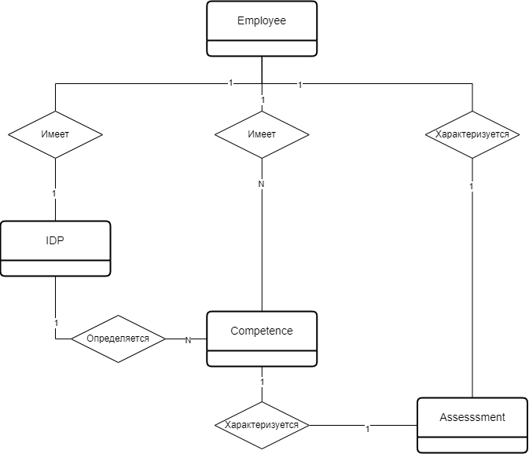
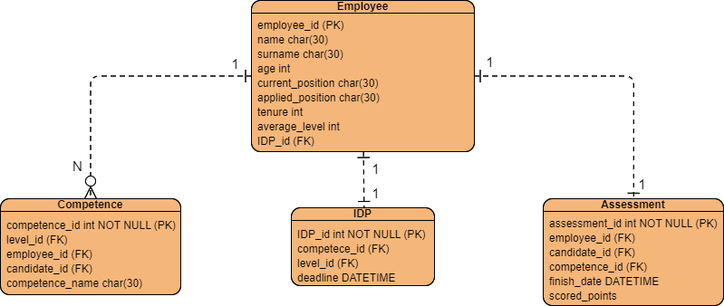
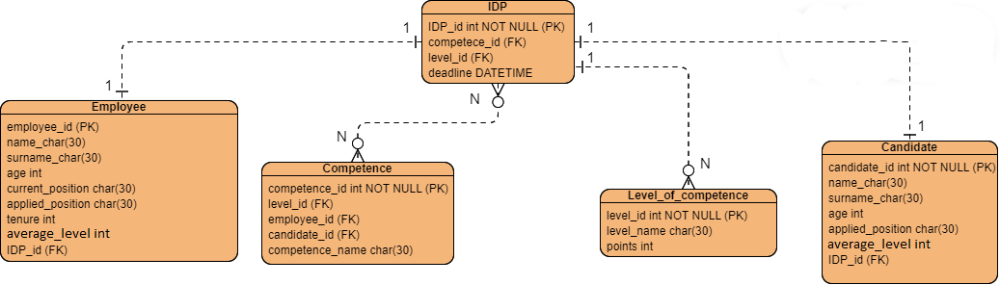
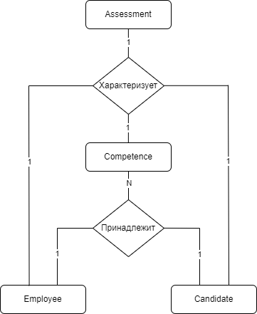
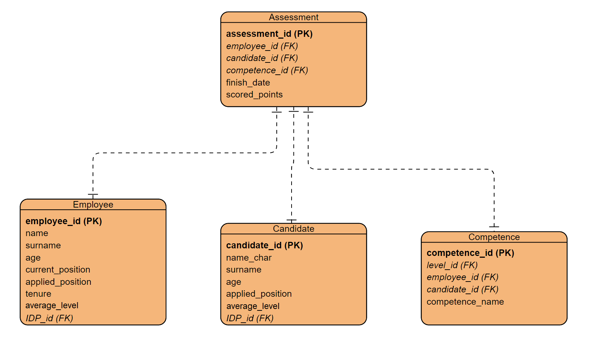
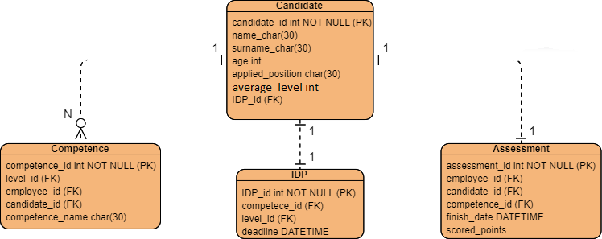

# 3. ОПИСАНИЕ СУЩНОСТЕЙ СИСТЕМЫ


## 3.1.	Сущности предметной области 1 - Competence
### 3.1.1.	Логическая схема Competence  

   
Рисунок 1 – Логическая схема Competence

Таблица 1 – Описание атрибутов сущности Competence
| № п/п | Атрибут | Обязательность | Тип данных |
|----|----|----|----|
| 1 | competence_id | Да | Число |
| 2 | employee_id | Да | Число |
| 3 | candidate_id | Да | Число |
| 3 | level_id | Да | Число |
| 3 | competence_name | Нет | Строка | 

### 3.1.2.	Физическая модель данных Competence 


  
Рисунок 2 – Физическая модель данных Competence

Таблица 2 – Описание атрибутов таблицы БД Competence
| № п/п | Атрибут         | Обязательность | Тип данных   | Комментарий                          | Правила валидации                                  |
|-------|-----------------|----------------|--------------|--------------------------------------|----------------------------------------------------|
| 1     | competence_id   | Да             | INT NOT NULL | Уникальный идентификатор компетенции | Уникальный, не NULL, положительное целое число     |
| 2     | employee_id     | Да             | INT NOT NULL | Уникальный идентификатор сотрудника  | Уникальный, не NULL, положительное целое число     |
| 3     | candidate_id    | Да             | INT NOT NULL | Уникальный идентификатор кандидата   | Уникальный, не NULL, положительное целое число     |
| 4     | level_id        | Да             | INT NOT NULL | Уникальный идентификатор уровня      | Уникальный, не NULL, положительное целое число     |
| 5     | competence_name | Нет            | VARCHAR(255) | Наименование компетенции             | Строка переменной длины (max 255)                  |

### 3.1.3.	SQL-запрос для Competence

##### Создание таблицы Competence 
```
CREATE TABLE Competence (
    Competence_id INT PRIMARY KEY AUTO_INCREMENT,
    Employee_id INT NOT NULL,
    Candidate_id INT NOT NULL,
    Level_id INT NOT NULL,
    Competence_name VARCHAR(255),
    CONSTRAINT fk_employee FOREIGN KEY (Employee_id) REFERENCES Employees(Employee_id),
    CONSTRAINT fk_candidate FOREIGN KEY (Candidate_id) REFERENCES Candidates(Candidate_id),
    CONSTRAINT fk_level FOREIGN KEY (Level_id) REFERENCES Level_of_competence(Level_id),
    CONSTRAINT chk_employee_or_candidate CHECK (
        (Employee_id IS NOT NULL AND Candidate_id IS NULL) OR 
        (Candidate_id IS NOT NULL AND Employee_id IS NULL)
    )
);
```
##### Вставка трех записей  
```
INSERT INTO Competence (Competence_id, Employee_id, Candidate_id, Level_id, Competence_name) VALUES
(1, 2, 0, 4, 'SQL'),
(5, 0, 7, 8, 'Python'),
(9, 10, 0, 12, 'C++');
```
##### Запрос для извлечения всех данных из таблицы  
```
SELECT *
FROM Competence;
```

##### Индексация
```
CREATE INDEX Competence_id ON Competence (Competence_id);
CREATE INDEX Employee_id ON Competence (Employee_id);
CREATE INDEX Candidate_id ON Competence (Candidate_id);
CREATE INDEX Level_id ON Competence (Level_id);
CREATE INDEX Competence_name ON Competence (Competence_name);
```
##### Удаление таблицы
```
DROP TABLE IF EXISTS Competence;
```
## 3.2.	Сущности предметной области 2 - Level_of_competence
### 3.2.1.  Логическая схема level_of_competence  
#### Атрибуты:
- Level_ID: Идентификатор уровня компетенции (первичный ключ)
- Level_Name: Название уровня компетенции
- Points: Количество баллов, соответствующее уровню  

 

Рисунок 3 – Логическая схема
### Описание сущности Level_of_competence

Таблица 3 – Описание атрибутов таблицы БД Level_of_competence
 № п/п | Атрибут    | Обязательность | Тип данных |
|:---|:---|:---|:---|
| 1 | Level_ID | Да | Число |
| 2  | Level_Name | Нет | Строка |
| 3 | Points | Нет | Число |

### 3.2.2.  Физическая модель данных level_of_competence 
  

Рисунок 4 – Физическая модель данных   

### Описание атрибутов сущности Level_of_competence

Таблица 4 – Описание атрибутов таблицы БД Level_of_competence
 № п/п | Атрибут    | Обязательность | Тип данных | Комментарий | Правила валидации |
|:---|:---|:---|:---|:---|:---|
| 1 | Level_ID | Да | Число | Уникальный идентификатор уровня компетенции | Уникальный, не NULL, положительное целое число |
| 2  | Level_Name | Нет | Строка | Название уровня компетенции | Максимум 255 символов, уникальное имя, не пустое, если задан|
| 3 | Points | Нет | Число | Количество баллов, соответствующее уровню | Не отрицательное число, целое или с плавающей точкой |

### 3.2.3. SQL-запрос для Level_of_competence

##### Создание таблицы Level_of_competence
```  
CREATE TABLE Level_of_competence (  
    Level_ID INT PRIMARY KEY,  
    Level_Name VARCHAR(255),  
    Points INT  
);
```
##### Вставка трех записей
```  
INSERT INTO Level_of_competence (Level_ID, Level_Name, Points) VALUES  
(1, 'Beginner', 10),  
(2, 'Intermediate', 20),  
(3, 'Advanced', 30);
```
##### Запрос для извлечения всех данных из таблицы 
``` 
SELECT *  
FROM Level_of_competence;
```
## 3.3.	Сущности предметной области 3 - Employee
### 3.3.1.  Логическая схема Employee 
 
<br/>Рисунок 5 – Логическая модель данных

#### Атрибуты:
Таблица 5 – Описание атрибутов таблицы БД предметной области 2
| № п/п | Атрибут | Обязательность | Тип данных |
|----|----|----|----|
| 1 |  name |  Да | Строка |
| 2 |  surname |  Да |  Строка |
| 3 | age |  Да | Число  |
| 4 |  current position |  Да |  Строка |
| 5 | applied position  | Да  | Строка  |
| 6 | tenure |  Да |  Число |
| 7 |  average_level |  Да | Число  |
| 8 |  IDP_id |  Да | Строка  |

### 3.3.2.  Физическая модель данных - Employee
 
<br/>Рисунок 6 – Физическая модель данных

### Описание атрибутов сущности Employee
Таблица 6 – Описание атрибутов таблицы БД Employee
| № п/п | Атрибут       | Обязательность | Тип данных   | Комментарий                          | Правила валидации                                  |
|-------|---------------|----------------|--------------|--------------------------------------|----------------------------------------------------|
| 1     | Employee_id | Да            | INT NOT NULL        | Уникальный идентификатор сотрудника | Уникальный, не NULL, положительное целое число |
| 2     | name | Да             | VARCHAR(255)        | Имя кандидата | Строка переменной длины (max 255) |
| 3     | surname   | Да             | VARCHAR(255)        | Фамилия кандидата  | Строка переменной длины (max 255) |
| 4     | age  | Да             | INT NOT NULL        | Возраст кандидата   | 	Положительное целое число |
| 5     |  current position |  Да |  VARCHAR(255)  | Наименование текущей должности | Строка переменной длины (max 255) |
| 6     | applied position | Да             | VARCHAR(255)        | Наименование применяемой позиции сотрудника | Строка переменной длины (max 255) |
| 7     | tenure  | Да             | INT NOT NULL        | Стаж кандидата   | 	Положительное целое число |
| 8     | average_level  | Да            | VARCHAR(255) | Наименование градации уровня сотрудника | Строка переменной длины (max 255) |
| 9     | IDP_id | Да            | INT NOT NULL        | Уникальный идентификатор ИПР | Уникальный, не NULL, положительное целое число |

### 3.3.3. SQL-запрос для Employee
##### Создание таблицы Employee
```   
CREATE TABLE Employee  (  
    employee_id INTEGER PRIMARY KEY,  
    name CHAR(255),  
    surname CHAR(255),  
    age INTEGER,
    current position CHAR(255),  
    applied position CHAR(255),  
    tenure INTEGER,
    average_level INTEGER,
    IDP_IP INTEGER
);
```
##### Вставка трех записей  
```
INSERT INTO Employee  (employee_id, name, surname, age, current position, applied position, tenure, average_level, IDP_IP) VALUES  
(1, 'Petr', 'Petrov', 26, 'Старший специалист', 'Ведущий специалист', '1 год 5 месяцев', 3, 1),  
(2, 'Maria', 20, 'Младший специалист', 'Ведущий специалист', '2 года 6 месяцев', 2, 2),  
(3, 'Violetta', 30, 'Старший специалист', 'Главный ведущий специалист', '4 года 7 месяцев', 1, 3);
```
##### Запрос для извлечения всех данных из таблицы  
```
SELECT *  
FROM Employee;
```

## 3.4.	Сущности предметной области 4 - IDP
### 3.4.1.  Логическая схема IDP 
 

Рисунок 7 – Логическая модель данных

#### Атрибуты:
Таблица 7 – Описание атрибутов таблицы БД предметной области 3
| № п/п | Атрибут | Обязательность | Тип данных |
|----|----|----|----|
| 1 |  competece_id|  Да | Строка |
| 2 |  level_id|  Да |  Число  |
| 3 | deadline |  Да | Число  |


### 3.4.2.Физическая модель данных IDP
 
<br/>Рисунок 8 – Физическая модель данных

### Описание атрибутов сущности IDP
Таблица 8 – Описание атрибутов таблицы БД IDP
| № п/п | Атрибут       | Обязательность | Тип данных   | Комментарий                          | Правила валидации                                  |
|-------|---------------|----------------|--------------|--------------------------------------|----------------------------------------------------|
| 1     | competece_id | Да             | INT NOT NULL        | Уникальный идентификатор компетенции | Уникальный, не NULL, положительное целое число |
| 2     | level_id | Да             | INT NOT NULL        | Уникальный идентификатор уровня  | Уникальный, не NULL, положительное целое число |
| 3     | deadline | Да             | INT NOT NULL        | Дата выполнения    | Формат YYYY-MM-DD HH:MM:SS |

### 3.4.3.SQL-запрос для IDP
##### Создание таблицы IDP_table
```   
CREATE TABLE IDP_table  (  
    competece_id INTEGER PRIMARY KEY,  
    level_id INT NOT NULL,  
    deadline INT NOT NULL 
);
```
##### Вставка трех записей  
```
INSERT INTO IDP_table  (competece_id, level_id, deadline) VALUES  
(1, 100, '31OCT2024'),  
(2, 101, '31OCT2024'),  
(3, 102, '31OCT2024');
```
##### Запрос для извлечения всех данных из таблицы  
```
SELECT *  
FROM IDP_table;
```

## 3.5.	Сущности предметной области 5 - Assessment
### 3.5.1. Логическая схема Assessment
#### Атрибуты:
- Assessment_id: идентификатор оценки (первичный ключ)
- Employee_id: идентификатор сотрудника (внешний ключ)
- Candidate_id: идентификатор кандидата (внешний ключ)
- Competence_id: идентификатор компетенции (внешний ключ)
- Finish_date: дата и время оценки
- Scored_points: количество баллов за тестирование



Рисунок 9 – Логическая схема
###  Описание сущности Assessment

Таблица 9 – Описание атрибутов таблицы БД Assessment
 № п/п | Атрибут    | Обязательность | Тип данных |
|:---|:---|:---|:---|
| 1 | Assessment_id | Да | Число |
| 2 | Employee_id | Да | Число |
| 3 | Candidate_id | Да | Число |
| 4 | Competence_id | Да | Число |
| 5 | Finish_date | Нет | Дата и время |
| 6 | Scored_points | Нет | Число |

### 3.5.2.Физическая модель данных Assessment
  

Рисунок 10 – Физическая модель данных   

###  Описание атрибутов сущности Assessment

Таблица 10 – Описание атрибутов таблицы БД Assessment
| № п/п | Атрибут       | Обязательность | Тип данных   | Комментарий                          | Правила валидации                                  |
|-------|---------------|----------------|--------------|--------------------------------------|----------------------------------------------------|
| 1     | Assessment_id | Да             | Число        | Уникальный идентификатор оценки      | Уникальный, не NULL, положительное целое число     |
| 2     | Employee_id   | Да             | Число        | Уникальный идентификатор сотрудника  | Уникальный, не NULL, положительное целое число     |
| 3     | Candidate_id  | Да             | Число        | Уникальный идентификатор кандидата   | Уникальный, не NULL, положительное целое число     |
| 4     | Competence_id | Да             | Число        | Уникальный идентификатор компетенции | Уникальный, не NULL, положительное целое число     |
| 5     | Finish_date   | Нет            | Дата и время | Дата и время оценки                  | Формат YYYY-MM-DD HH:MM:SS                         |
| 6     | Scored_points | Нет            | Число        | Количество баллов за тестирование    | Положительное целое число                          |

### 3.5.3. SQL-запрос для Assessment

##### Создание таблицы Assessment 
```
CREATE TABLE Assessment (
    Assessment_id INT PRIMARY KEY AUTO_INCREMENT,
    Employee_id INT NOT NULL,
    Candidate_id INT NOT NULL,
    Competence_id INT NOT NULL,
    Finish_date DATETIME NOT NULL,
    Scored_points INT CHECK (Scored_points >= 0),
    CONSTRAINT fk_employee FOREIGN KEY (Employee_id) REFERENCES Employees(Employee_id),
    CONSTRAINT fk_candidate FOREIGN KEY (Candidate_id) REFERENCES Candidates(Candidate_id),
    CONSTRAINT fk_competence FOREIGN KEY (Competence_id) REFERENCES Competences(Competence_id),
    CONSTRAINT chk_employee_or_candidate CHECK (
        (Employee_id IS NOT NULL AND Candidate_id IS NULL) OR 
        (Candidate_id IS NOT NULL AND Employee_id IS NULL)
    )
);
```
##### Вставка трех записей 
``` 
INSERT INTO Assessment (Assessment_id, Employee_id, Candidate_id, Competence_id, Finish_date, Scored_points) VALUES
(1, 4, 3, 7, '2024-10-16 14:30:45', 10),
(2, 9, 3, 1, '2024-10-16 15:24:31', 12),
(3, 5, 7, 4, '2024-10-16 16:11:56', 15);
```
##### Запрос для извлечения всех данных из таблицы  
```
SELECT *
FROM Assessment;
```


## 3.6.	Сущности предметной области 6 - Candidate
### 3.6.1.  Логическая схема Candidate 
 
<br/>Рисунок 11 – Логическая модель данных

#### Атрибуты:
Таблица 11 – Описание атрибутов таблицы БД предметной области 6
| № п/п | Атрибут | Обязательность | Тип данных |
|----|----|----|----|
| 1 |  name |  Да | Строка |
| 2 |  surname |  Да |  Строка |
| 3 | age |  Да | Число  |
| 4 | applied position | Да  | Строка  |
| 5 |  average_level |  Да | Число  |
| 6 |  IDP_id |  Да | Строка  |


### 3.6.2.  Физическая модель данных - Candidate
 
<br/>Рисунок 12 – Физическая модель данных

### Описание атрибутов сущности Candidate
Таблица 12 – Описание атрибутов таблицы БД Assessment
| № п/п | Атрибут       | Обязательность | Тип данных   | Комментарий                          | Правила валидации                                  |
|-------|---------------|----------------|--------------|--------------------------------------|----------------------------------------------------|
| 1     | name | Да             | VARCHAR(255)        | Имя кандидата | Строка переменной длины (max 255) |
| 2     | surname   | Да             | VARCHAR(255)        | Фамилия кандидата  | Строка переменной длины (max 255) |
| 3     | age  | Да             | INT NOT NULL        | Возраст кандидата   | Положительное целое число |
| 4     | applied position | Да             | VARCHAR(255)        | Наименование применяемой позиции сотрудника | Строка переменной длины (max 255) |
| 5     | average_level  | Да            | VARCHAR(255) | Наименование градации уровня сотрудника | Строка переменной длины (max 255) |
| 6     | IDP_id | Да            | INT NOT NULL        | Уникальный идентификатор ИПР | Уникальный, не NULL, положительное целое число |
### 3.6.3. SQL-запрос для Candidate
##### Создание таблицы Candidate
```   
CREATE TABLE Candidate  (  
    name VARCHAR(255),  
    surname VARCHAR(255),  
    age INT NOT NULL,
    applied_position VARCHAR(255),
    average_level VARCHAR(255),
    IDP_id INT NOT NULL 
);
```
##### Вставка трех записей  
```
INSERT INTO Candidate  (name, surname, age, applied_position, average_level, IDP_id) VALUES  
('Petr', 'Petrov', 26, 'Ведущий специалист', 3, 1),  
('Maria', 'Sidorova', 20, 'Ведущий специалист', 2, 2),  
('Violetta', 'Karpova', 30, 'Главный специалист', 1, 3);
```
##### Запрос для извлечения всех данных из таблицы  
```
SELECT *  
FROM Candidate;
```