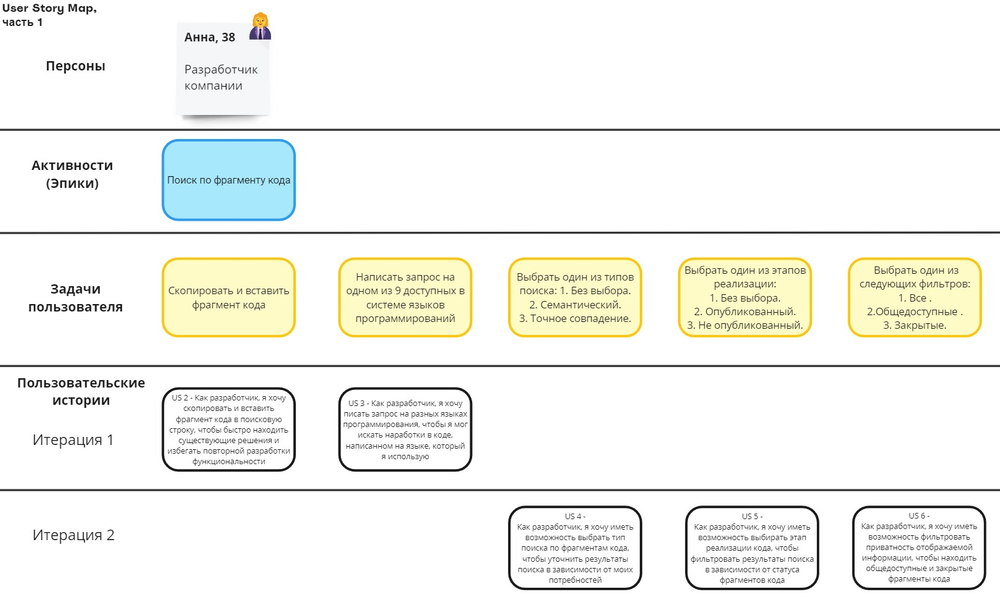
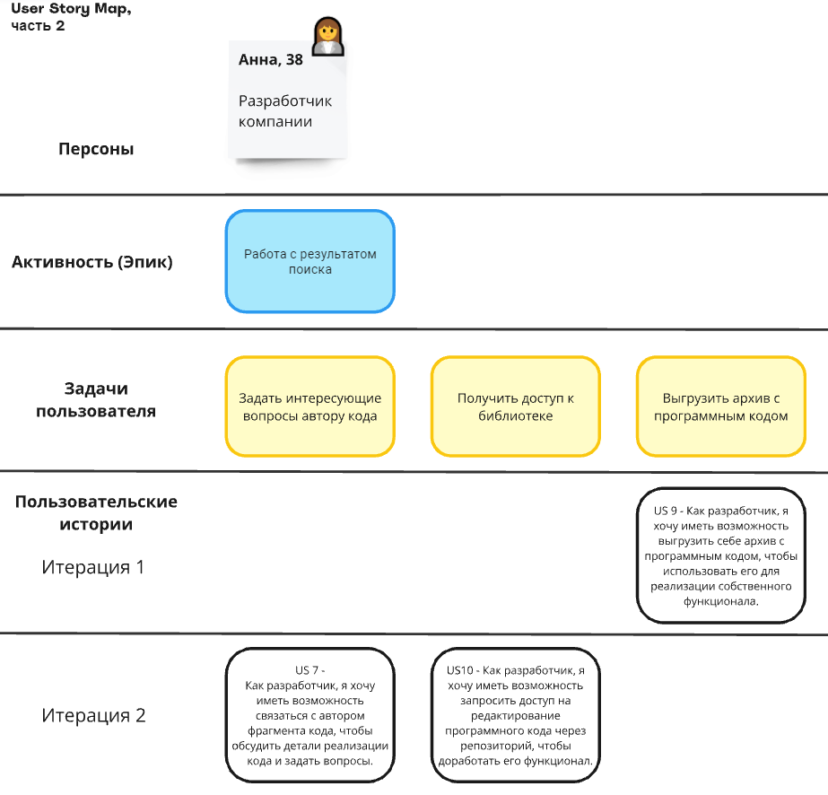

## 2. Описание пользовательских требований
  
  При описании пользовательских требований в части приоритезации нами был использован метод MoSCoW. Это метод для задания приоритета историй.  Метод MoSCoW обеспечивает способ достижения общего понимания относительной важности поставляемой истории. Его аббревиатура расшифровывается как **must haves** (обязательные требования), **should haves** (важные требования), **could haves** (возможные требования) и **will not haves** (несущественные требования).
 
  1. **Must Have**. Это истории, которые должны быть поставлены для решения текущих проблем бизнеса. Обязательные требования. 
 
2. **Should Have**. Это истории, которые имеют решающее значение для успеха релиза. Истории «Should» столь же важны, как и истории «Must», но они могут не быть срочным или для их реализации их можно использовать обходной путь (workaround).
 
3. **Could Have**. Это менее критичные истории. Возможные требования. Эти требования желательны, но не оказывают такого влияния, как другие.
 
4. **Would Like**. Эти истории, скорее всего, не будут включены; несущественные требования. Эти требования не являются приоритетными для проекта. 
 

### Эпик 1. Поиск по фрагменту кода 

Таблица №1 –  Описание истории "Поиск по ключевым словам"
| **История** | **US1 - Поиск по ключевым словам** |
|----|----|
| Приоритет | Must Have |
| Описание | Как разработчик, я хочу ввести ключевые слова в поисковую строку, чтобы найти фрагменты кода, которые содержат эти слова.|
| Заметки/ предположения/ ограничения | **Заметки**: Сервис должен учитывать морфологию и синтаксис языка программирования при поиске. Сервис должен быть оптимизирован для быстрого поиска по большому объему данных. |
| Критерии приемки | Когда разработчик вводит ключевые слова в поисковую строку, сервис принимает запрос, и система ему выдает варианты ответов с содержанием кода.  |

Таблица №2 –  Описание истории "Поиск по фрагменту кода"
| **История** | **US2 - Поиск по фрагменту кода** |
|----|----|
| Приоритет | Must Have |
| Описание | Как разработчик, я хочу скопировать и вставить фрагмент кода в поисковую строку, чтобы  быстро находить существующие решения и избегать повторной разработки функциональности.|
| Заметки/ предположения/ ограничения | **Предположения**: есть интеграция сервиса с репозиториями компании; система устойчива к опечаткам, выдает ответы по ключевым словам, векторному и семантическому поиску; система выдает варианты ответов от большего количества совпадений по контексту к меньшему; система выдает варинты ответов списком, пока подходящие ответы не закончатся. **Ограничения**: отклик системы составляет не более 2 сек. **Заметки**: Сервис должен использовать алгоритмы сравнения кода для выявления сходства. Сервис должен учитывать синтаксис языка программирования при сравнении. |
| Критерии приемки |Когда пользователь вводит фрагмент кода в строку поиска, система ему выдает варианты ответов с содержанием кода. Сервис принимает фрагменты кода в качестве поисковых запросов. Сервис позволяет сравнивать фрагменты кода по различным параметрам.  |

Таблица №3 –  Описание истории "Выбор языка программирования"
| **История** | **US3 - Поиск фрагмента кода на разных языках программирования** |
|----|----|
| Приоритет | Should Have |
| Описание | Как разработчик, я хочу писать запрос на разных языках программирования, чтобы я мог искать наработки в коде, написанном на языке, который я использую |
| Заметки/ предположения/ ограничения | **Предположения**: система распознает популярные языки программирования; если язык программирования определен неверно, пользователь может применить встроенные в систему фильтры. **Ограничения**: система распознает только Python, C,  C++,  Java,  C#,  JavaScript, Visual Basic,  PHP,  Assembly Language. |
| Критерии приемки | Если разработчик написал запрос на одном из 9 доступных в системе языков программирований, то система выдала ответы релевантные языку программирования в запросе пользователя |

Таблица №4 –  Описание истории "Выбор типа поиска"
| **История** | **US4 - Выбор типа поиска** |
|----|----|
| Приоритет | Should Have |
| Описание | Как разработчик, я хочу иметь возможность выбрать тип поиска по фрагментам кода, чтобы уточнить результаты поиска в зависимости от моих потребностей. |
| Заметки/ предположения/ ограничения | **Предположения**:  Предполагается, что семантический поиск будет реализован с использованием алгоритмов машинного обучения. **Ограничения**: Ограничение на количество типов поиска может быть введено для упрощения интерфейса. Необходимо учитывать производительность системы при реализации семантического поиска. |
| Критерии приемки | Когда Пользователь выбрал один из трех типов поиска: 
 1. Без выбора (поиск по всем доступным фрагментам кода). 
 2. Семантический (поиск по смыслу и контексту кода). 
 3. Точное совпадение (поиск по точному тексту фрагмента кода), 
 то сервис отфильтровал результаты запроса в зависимости от выбранного типа поиска. |

Таблица №5 –  Описание истории "Выбор этапа реализации кода"
| **История** | **US5 - Выбор этапа реализации кода** |
|----|----|
| Приоритет | Should Have |
| Описание | Как разработчик, я хочу иметь возможность выбирать этап реализации кода, чтобы фильтровать результаты поиска в зависимости от статуса фрагментов кода. |
| Заметки/ предположения/ ограничения | **Заметки**:  Необходимо учитывать возможные задержки в обновлении статусов фрагментов кода в реальном времени. |
| Критерии приемки | Когда Пользователь выбрал один из трех этапов реализации: 
 1. Без выбора (поиск по всем доступным фрагментам кода). 
 2. Опубликованный (только те фрагменты, которые были опубликованы). 
 3. Не опубликованный (только те фрагменты, которые еще не были опубликованы), 
 то  сервис отфильтровал результаты запроса в зависимости от выбранного статуса фрагмента кода. |

Таблица №6 –  Описание истории "Фильтрация по приватности отображаемой информации"
| **История** | **US6 - Фильтрация по приватности отображаемой информации** |
|----|----|
| Приоритет | Should Have |
| Описание | Как разработчик, я хочу иметь возможность фильтровать приватность отображаемой информации, чтобы находить общедоступные и закрытые фрагменты кода. |
| Заметки/ предположения/ ограничения | **Заметки**: Пользовательский интерфейс должен быть интуитивно понятным, чтобы пользователи могли легко находить и применять нужные фильтры. **Ограничения**: Следует учитывать безопасность данных, чтобы закрытые фрагменты кода не были доступны пользователям без соответствующих прав доступа |
| Критерии приемки | Когда Пользователь выбрал один из следующих фильтров: 
 1. Все (поиск по всем фрагментам кода, как общедоступным, так и закрытым). 
  2.Общедоступные (поиск только по общедоступным фрагментам кода). 
 3. Закрытые (поиск только по закрытым фрагментам кода). 
 После выбора фильтра результаты поиска должны обновляться в соответствии с выбранным параметром. 
 Если пользователь не делает выбор, система должна использовать поиск по умолчанию (например, "Все"), 
 то  сервис отфильтровал результаты запроса в зависимости от выбранной приватности отображаемой информации. |

### Эпик 2. Работа с результатом поиска 

Таблица №7 –  Описание истории "Связь с автором фрагмента кода"
| **История** | **US7 - Связь с автором фрагмента кода** |
|----|----|
| Приоритет |  Could Have |
| Описание | Как разработчик, я хочу иметь возможность связаться с автором фрагмента кода, чтобы обсудить детали реализации кода и задать вопросы |
| Заметки/ предположения/ ограничения | **Предположения**: все фрагменты кода содержат информацию об авторе. **Ограничения**: комментарии могут оставляться только авторизованными пользователями |
| Критерии приемки | Когда разработчик нажимает кнопку «Посмотреть информацию об авторе" в интерфейсе фрагмента кода, тогда система должна открывать окошко с данными об авторе, включая имя, дату создания документа, его текущее состояние, контактную информацию. Также, когда разработчик оставляет комментарий, система должна сохранять его и отображать под фрагментом кода |

Таблица №8 –  Описание истории "Копирование кода в буфер обмена"
| **История** | **US8 - Копирование кода в буфер обмена** |
|----|----|
| Приоритет |  Must Have |
| Описание | Как разработчик, я хочу иметь возможность скопировать себе найденный программный код в буфер обмена, чтобы использовать его для реализации собственного функционала. |
| Заметки/ предположения/ ограничения | **Предположения**: Предполагается, что пользователь использует современный браузер, поддерживающий работу с буфером обмена.|
| Критерии приемки | Система дает возможность выделить и скопировать программный код в буфер обмена. Пользователь может нажать кнопку "Скопировать" рядом с найденным фрагментом кода либо может скопировать с помощью сочетания клавиш "Ctrl + C". Должна быть возможность скопировать код как в текстовом, так и в формате Markdown (если применимо). |

Таблица №9 –  Описание истории "Выгрузка архива с программным кодом"
| **История** | **US9 - Выгрузка архива с программным кодом** |
|----|----|
| Приоритет |  Must Have |
| Описание | Как разработчик, я хочу иметь возможность выгрузить себе архив с программным кодом, чтобы использовать его для реализации собственного функционала. |
| Заметки/ предположения/ ограничения | **Заметки**: Ограничения на размер выгружаемого архива могут быть установлены для обеспечения производительности.|
| Критерии приемки | Система дает возможность скачать или склонировать программный код. Пользователь может нажать кнопку "Выгрузить архив" рядом с найденным фрагментом кода. После завершения выгрузки должно появляться уведомление о завершении процесса. |

Таблица №10 –  Описание истории "Запрос доступа на редактирование кода"
| **История** | **US10 - Запрос доступа на редактирование кода** |
|----|----|
| Приоритет | Could Have |
| Описание | Как разработчик, я хочу иметь возможность запросить доступ на редактирование программного кода через репозиторий, чтобы доработать его функционал. |
| Заметки/ предположения/ ограничения | **Заметки**: Процесс обработки запросов должен быть четко регламентирован. Система должна иметь механизм управления правами доступа для обеспечения безопасности.|
| Критерии приемки | Система дает возможность перейти на репозиторий найденного программного кода и запросить доступ на его редактирование |

Таблица №11 –  Описание истории "Отправка заявки на изменение кода"
| **История** | **US11 - Отправка заявки на изменение кода** |
|----|----|
| Приоритет | Could Have |
| Описание | Как разработчик, я хочу иметь возможность отправить заявку с просьбой изменить программный код, чтобы авторы доработали его функционал. |
| Заметки/ предположения/ ограничения | **Заметки**: Предполагается наличие механизма отслеживания статуса заявок. Важно обеспечить прозрачность процесса, чтобы пользователи могли видеть статус своих заявок.|
| Критерии приемки | Система должна предоставить форму для описания изменений и причин запроса.Система дает возможность отправить заявку через всплывающее текстовое окно для ввода данных. |

